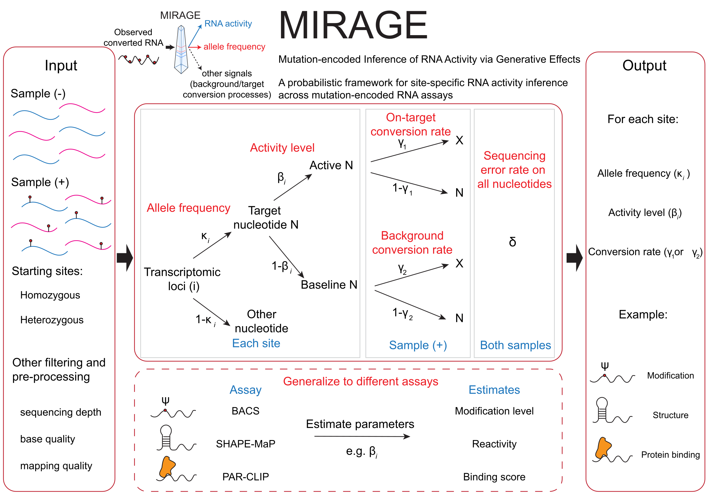

# MIRAGE

[](https://github.com/yangli04/MIRAGE)
[](https://github.com/yangli04/MIRAGE/blob/main/LICENSE)

`MIRAGE` (Mutation-encoded Inference of RNA Activity via Generative Effects)
is an R package for estimating site-level RNA activity from matched treatment
and control read-count tables produced by mutation-encoded RNA assays. Many
assays that read out RNA modification, RNA structure, or protein binding
encode the signal of interest as a sequencing-detectable base change. The
observed mismatch rate at a site is then a mixture of the treatment-induced
signal, background conversion, sequencing error, and possible genetic
variation. MIRAGE models this mixture generatively and infers, for every site:

- a latent **activity level** `beta_est` (β): the fraction of molecules that
  carry the signal (modification stoichiometry, reactivity, or crosslinking);
- the **on-target** conversion rate `lambda1` (γ₁) and the **background**
  conversion rate `lambda2` (γ₂), estimated from the data or supplied;
- the **reference-allele fraction** `kappa_est` (κ) at heterozygous or
  allele-mixed sites, so that genetic variants are not called as signal;
- per-site tests and FDR values that separate signal from background.

Because one model spans all assays, otherwise incompatible readouts are placed
on a common, calibrated β scale with per-site false-discovery control.



## Two Implementations: R Package And Rust Binary

MIRAGE is available in two interoperable implementations that read the same
count table and produce the same per-site estimates:

| | **MIRAGE** (this repository, R) | [**MIRAGE_fast**](https://github.com/yangli04/MIRAGE_fast) (Rust) |
|---|---|---|
| Best for | interactive analysis, tutorials, plotting, R/Bioconductor workflows | large tables (10⁵–10⁷ sites), pipelines (Snakemake/Nextflow), HPC batch jobs |
| Interface | R functions returning data frames; `plot_signal_scatter()` | `mirage` command-line tool reading/writing TSV; Rust library |
| Speed / memory | reference implementation | ~35–50× faster, ~2× less memory, numerically identical (≤ 1e-7) |
| Install | `devtools::install_github("yangli04/MIRAGE")` | `git clone https://github.com/yangli04/MIRAGE_fast && cargo build --release` |

Prototype in R and scale up with the Rust binary (or the reverse) without
changing anything else in your workflow. The rest of this README and the
tutorials describe the R package.

## Installation

### GitHub

To install `MIRAGE` from GitHub and build the tutorials, run this in R:

```r
install.packages("devtools")
devtools::install_github("yangli04/MIRAGE", build_vignettes = TRUE)
```

### Source

If you have cloned this repository locally, install it from the repository root:

```r
install.packages("devtools")
devtools::install_local(build_vignettes = TRUE)
```

or, for a fast install without rebuilding the tutorials:

```bash
R CMD INSTALL .
```

The core dependencies (`doParallel`, `dplyr`, `foreach`) are declared in
`DESCRIPTION`; `ggplot2` is needed for `plot_signal_scatter()` and the
tutorials. A ready-made micromamba environment with everything required to
install the package, run the tutorials, and rebuild the documentation site is
provided in [envs/](envs/README.md):

```bash
micromamba env create -f envs/mirage-r.yml
micromamba run -n mirage-r R CMD INSTALL .
```

## Tutorials

Three tutorials walk through one complete MIRAGE analysis each. Every
tutorial reads a small, real count table that ships with the package
(`inst/extdata/`), so they run in seconds without external data.

| tutorial | assay | what β means | source |
|---|---|---|---|
| [RNA modification (BACS)][tutorial-bacs] | BACS pseudouridine sequencing of HeLa cytosolic rRNA | Ψ stoichiometry, compared with mass spectrometry | [vignettes/mirage-bacs.Rmd][source-bacs] |
| [RNA structure (SHAPE-MaP)][tutorial-structure] | 2A3 in vitro probing of *E. coli* 16S/23S rRNA versus DMSO | per-nucleotide reactivity, compared with the CRW secondary structure | [vignettes/mirage-rna-structure.Rmd][source-structure] |
| [Protein binding (PAR-CLIP)][tutorial-parclip] | MOV10 PAR-CLIP versus mock control (chr21/22 subset) | crosslink-site binding score with FDR control | [vignettes/mirage-par-clip.Rmd][source-parclip] |

After installing with `build_vignettes = TRUE`, the same tutorials can be
opened from R:

```r
library(MIRAGE)

vignette("mirage-bacs", package = "MIRAGE")
vignette("mirage-rna-structure", package = "MIRAGE")
vignette("mirage-par-clip", package = "MIRAGE")
```

The tutorials use `estimate_inference_with_empirical()`, the motif-free
workflow. The motif-aware functions `compute_prior()` and
`estimate_inference_with_prior()` are documented below for users who have
independent motif-prior information.

## Basic MIRAGE Workflow

MIRAGE starts from one matched treatment/control count table. The table can be
created by any preprocessing pipeline (for example, `samtools mpileup`,
`pileup2var`, or `cpup`) as long as each row describes the same site in both
samples.

Required columns:

| column | meaning |
|---|---|
| `pos` | Unique site identifier, usually `chrom_coordinate_strand`, such as `chr1_14404_-`. |
| `motif` | Local sequence context, typically a 5-mer using RNA alphabet `A/C/G/U`. |
| `type` | User-defined site class or motif class. |
| `treated_fixed_count` | Reads that match the reference/non-converted base in the treatment sample. |
| `treated_depth` | Total treatment read depth at the site. |
| `control_fixed_count` | Reads that match the reference/non-converted base in the control sample. |
| `control_depth` | Total control read depth at the site. |

`fixed_count` is the non-signal count. MIRAGE internally uses
`1 - fixed_count / depth` as the observed mutation or conversion rate. `motif`
and `type` are only used by the motif-aware functions and can be placeholders
for the empirical workflow.

```r
library(MIRAGE)

count_table <- read.delim("path/to/site_count_table.tsv")

required <- c(
  "pos", "motif", "type",
  "treated_fixed_count", "treated_depth",
  "control_fixed_count", "control_depth"
)
stopifnot(all(required %in% names(count_table)))
stopifnot(all(count_table$treated_fixed_count <= count_table$treated_depth))
stopifnot(all(count_table$control_fixed_count <= count_table$control_depth))
```

Run the motif-free empirical model:

```r
res <- estimate_inference_with_empirical(
  chr.info = count_table[, c("pos", "motif", "type")],
  treatment_fixed_count = count_table$treated_fixed_count,
  control_fixed_count = count_table$control_fixed_count,
  treatment_depth = count_table$treated_depth,
  control_depth = count_table$control_depth,
  delta = 0.001,
  depth.cutoff = 10,
  homo.cutoff = 0.99,
  lambda1 = "auto",
  top.sites = NULL,
  bg.method = "lrt",
  bg.target = "both",
  highly.methyl.cutoff = 0.95,
  seed = 123,
  thread = 1
)
```

Inspect and save the output:

```r
plot_signal_scatter(res)                          # colored by significance
plot_signal_scatter(res, color_by = "beta_est")   # shaded by inferred signal

dir.create("mirage_output", showWarnings = FALSE)
saveRDS(res, "mirage_output/mirage_result.rds")
write.table(res$homosites, "mirage_output/mirage_homosites.tsv",
            sep = "\t", quote = FALSE, row.names = FALSE)
write.table(res$hetersites, "mirage_output/mirage_hetersites.tsv",
            sep = "\t", quote = FALSE, row.names = FALSE)
```

## Function Guide

### `estimate_inference_with_empirical()`

Use this function when you do not want to provide a motif prior. It estimates a
shared empirical background rate and either estimates, reads from sites, or uses
a fixed on-target mutation/conversion rate.

Important arguments:

- `lambda1`: use `"auto"` to estimate the on-target rate from high-signal
  candidate sites, `"site"` to estimate it from `top.sites`, or a numeric value
  between 0 and 1 to fix it.
- `top.sites`: character vector of site IDs used only when `lambda1 = "site"`.
- `bg.method`: statistical test used to separate background and candidate
  signal sites. Choose `"binomial"`, `"fisher"`, or `"lrt"`.
- `bg.target`: counts used to estimate the background rate. Choose
  `"treatment"`, `"control"`, or `"both"`.
- `depth.cutoff`: minimum treatment and control read depth retained for
  inference.
- `homo.cutoff`: minimum control fixed-base rate used to classify a site as
  homozygous.
- `delta`: assumed sequencing error rate.
- `thread`: number of parallel workers. Use `1` for the most portable behavior.

### `compute_prior()`

Use this function when you have independent motif information and want
sequence-context priors for motif-aware MIRAGE inference.

```r
motif_prior <- compute_prior(
  motif_freq_exp = motif_freq_exp,
  motif_freq_bg = motif_freq_bg,
  target_motif = "NNUNN",
  target_base_index = 3,
  prob_methylation = 0.01
)
```

Important inputs:

- `motif_freq_exp`: data frame with `motif` and `freq` columns describing motif
  frequencies among known or independently measured signal sites.
- `motif_freq_bg`: data frame with `motif`, `tx_count`, and `genome_count`
  columns describing motif counts in the transcriptome or background search
  space.
- `target_motif`: motif pattern to treat as the target motif. MIRAGE expands
  supported degenerate bases internally.
- `target_base_index`: 1-based position of the target base within
  `target_motif`.
- `prob_methylation`: prior genome/transcriptome-wide probability that the
  target base carries true signal.

### `estimate_inference_with_prior()`

Use this function when sequence context should influence the prior probability
of true signal.

```r
res <- estimate_inference_with_prior(
  chr.info = chr_info,
  treatment_fixed_count = count_table$treated_fixed_count,
  control_fixed_count = count_table$control_fixed_count,
  treatment_depth = count_table$treated_depth,
  control_depth = count_table$control_depth,
  motif_specific = TRUE,
  delta = 0.001,
  depth.cutoff = 10,
  homo.cutoff = 0.99,
  bg.method = "fisher",
  highly.methyl.cutoff = 0.95,
  ref.freq.tab = motif_prior,
  seed = 123,
  thread = 1,
  motif = "NNUNN",
  Nmer = "5mer"
)
```

Important arguments:

- `motif_specific`: if `TRUE`, MIRAGE estimates motif-specific on-target rates.
  If `FALSE`, one overall on-target rate is used while still applying the prior
  table.
- `ref.freq.tab`: motif prior table, usually from `compute_prior()`. It must
  contain at least `motif` and `prior_methylated`.
- `motif`: target motif pattern used to define target-context sequences.
- `Nmer`: how to group 5-mer target motifs for estimating motif-specific
  on-target rates. Choose `"5mer"`, `"f4mer"`, or `"l4mer"`.

## Output Objects

Both inference functions return a list:

```r
names(res)
#> "homosites" "hetersites" "lambda1" "lambda2"
```

| object | meaning |
|---|---|
| `res$homosites` | Sites classified as homozygous by the control fixed-base rate. |
| `res$hetersites` | Sites modeled as heterozygous or allele-mixed. |
| `res$lambda1` | Estimated or supplied on-target mutation/conversion rate. For motif-aware inference this can be a motif table. |
| `res$lambda2` | Estimated background mutation/conversion rate. |

Common output columns include `treatment_fixed_rate`, `control_fixed_rate`,
`beta_est`, `binom_p`, `binom_fdr`, `fisher_p`, `fisher_fdr`, `lrt_p`, and
`lrt_fdr`. `hetersites` also includes `kappa_est`, the estimated allele-mixing
fraction.

For downstream analysis, users commonly filter on a combination of `beta_est`
and one of the FDR columns. Choose the test column consistently with
`bg.method` and with the assumptions of your assay.

## Example Data

The tables under `inst/extdata/` used by the tutorials were derived from
public data:

| file | content | source |
|---|---|---|
| `bacs_hela_cyrRNA_counts.tsv`, `bacs_hela_cyrRNA_silnas.tsv` | pooled BACS versus untreated control T/C counts at 1,169 uridines of human cytosolic rRNA; SILNAS mass-spectrometry Ψ annotation | GEO GSE241849 (Kong et al., 2024); Taoka et al., 2018 |
| `shapemap_ecoli_rRNA_2A3_invitro_counts.tsv`, `shapemap_ecoli_rRNA_CRW_pairing.tsv` | 2A3 in vitro versus pooled DMSO mutation counts on *E. coli* 16S/23S rRNA; CRW base-pairing annotation | BioProject PRJNA646706; Comparative RNA Web |
| `parclip_mov10_chr21_chr22_counts.tsv` | MOV10 PAR-CLIP versus mock T/C counts, chromosomes 21 and 22 | GEO GSE48245 (Gregersen et al., 2014) |
| `pos.read.count.example.*.txt`, `NNANN.freq.*.txt`, `*.fa` | small legacy examples used in the function documentation | — |

## Citation

If you use MIRAGE, please cite the MIRAGE manuscript and the package
(`citation("MIRAGE")`).

## License

All source code and software in this repository are made available under the
terms of the [MIT license](LICENSE).

[tutorial-bacs]: https://yangli04.github.io/MIRAGE/articles/mirage-bacs.html
[tutorial-structure]: https://yangli04.github.io/MIRAGE/articles/mirage-rna-structure.html
[tutorial-parclip]: https://yangli04.github.io/MIRAGE/articles/mirage-par-clip.html
[source-bacs]: https://github.com/yangli04/MIRAGE/blob/main/vignettes/mirage-bacs.Rmd
[source-structure]: https://github.com/yangli04/MIRAGE/blob/main/vignettes/mirage-rna-structure.Rmd
[source-parclip]: https://github.com/yangli04/MIRAGE/blob/main/vignettes/mirage-par-clip.Rmd
