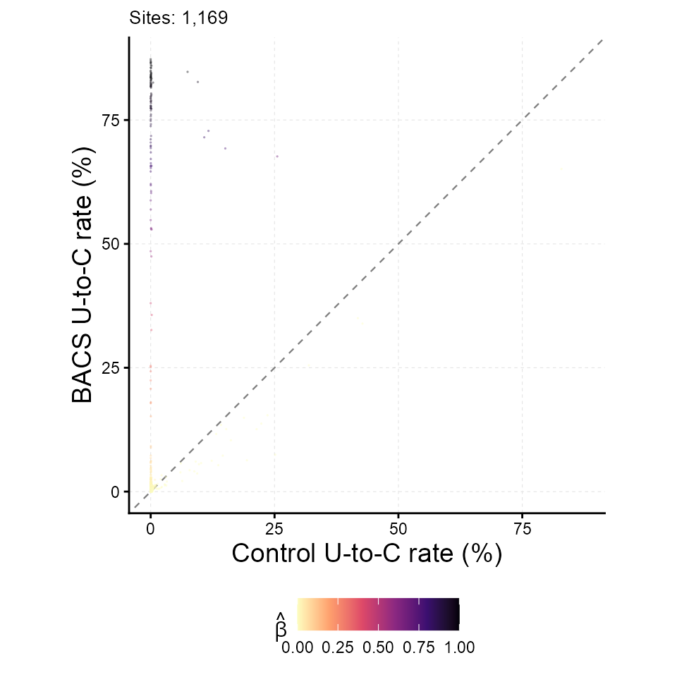
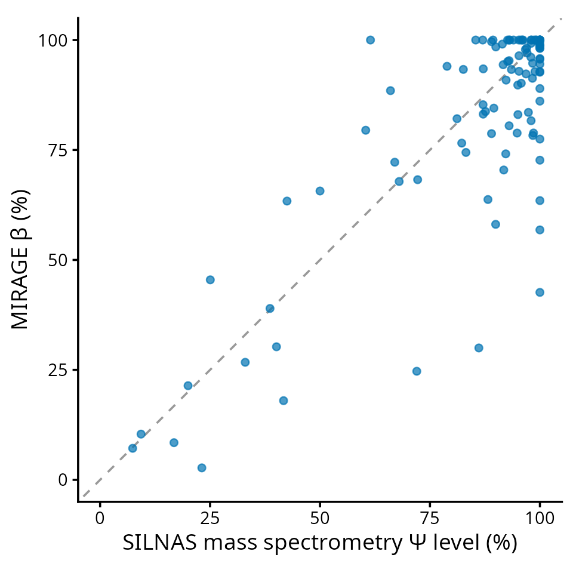

# MIRAGE RNA Modification Tutorial (BACS pseudouridine)

This tutorial shows how MIRAGE quantifies an RNA modification from a
mutation-encoded modification assay. The example is BACS (bisulfite-free
absolute and quantitative sequencing of pseudouridine), in which
pseudouridine (Ψ) is read out as an apparent U-to-C substitution while
unmodified uridines remain largely unchanged. Under MIRAGE the model
parameters take a direct chemical meaning:

| MIRAGE parameter | meaning in BACS |
|----|----|
| `beta_est` (β) | fraction of RNA molecules carrying Ψ at the site, i.e. the Ψ stoichiometry |
| `lambda1` (γ₁) | on-target Ψ-to-C conversion rate of a fully modified site |
| `lambda2` (γ₂) | background U-to-C conversion rate at unmodified uridines |
| `kappa_est` (κ) | reference-allele fraction at heterozygous or allele-mixed sites |

Because β is expressed on the molecule scale after removing background,
sequencing error, and allele mixing, MIRAGE returns an absolute
modification level without a synthetic calibration curve.

## Conceptual Overview

BACS pseudouridine readout and its MIRAGE parameterization.

## The Example Data

The package ships a small, complete count table built from public HeLa
BACS small-RNA libraries (Gene Expression Omnibus GSE241849). Reads were
aligned to the human cytosolic rRNA references (RefSeq NR_003286.4 18S,
NR_003287.4 28S, NR_003285.3 5.8S), and every uridine position with
sufficient depth was kept. For each uridine, the treated (BACS) T and C
counts of two replicates were pooled, and the untreated control
libraries were pooled as the matched control.

`count_table`` ``<-`` `[`read.delim`](https://rdrr.io/r/utils/read.table.html)`(`` `` `[`system.file`](https://rdrr.io/r/base/system.file.html)`(``"extdata"``, ``"bacs_hela_cyrRNA_counts.tsv"``, package ``=`` ``"MIRAGE"``)`` ``)`` `` `[`nrow`](https://rdrr.io/r/base/nrow.html)`(``count_table``)`` ``#> [1] 1169`` `[`head`](https://rdrr.io/r/utils/head.html)`(``count_table``, ``5``)`` ``#> pos motif type treated_fixed_count treated_depth`` ``#> 1 NR_003285.3_RNA5_8SN5_100 NNUNN Psi 3197 3209`` ``#> 2 NR_003285.3_RNA5_8SN5_110 NNUNN Psi 3744 3782`` ``#> 3 NR_003285.3_RNA5_8SN5_111 NNUNN Psi 3557 3592`` ``#> 4 NR_003285.3_RNA5_8SN5_123 NNUNN Psi 3565 3583`` ``#> 5 NR_003285.3_RNA5_8SN5_124 NNUNN Psi 3414 3602`` ``#> control_fixed_count control_depth`` ``#> 1 2926 2927`` ``#> 2 3128 3130`` ``#> 3 2941 2941`` ``#> 4 2658 2659`` ``#> 5 2627 2627`

The seven required columns are `pos`, `motif`, `type`,
`treated_fixed_count`, `treated_depth`, `control_fixed_count`, and
`control_depth`. `fixed_count` is the number of reads that still show
the reference base (here, T); MIRAGE models `1 - fixed_count / depth` as
the observed conversion rate. The site identifier `pos` can be any
unique string; here it is `<RefSeq accession>_<position>`. `motif` and
`type` are placeholders because the empirical (motif-free) model does
not use motif priors.

A second table records which of these uridines are known Ψ sites
according to an orthogonal mass-spectrometry (SILNAS) map of the human
ribosome, together with the measured Ψ occupancy. It is used only for
evaluation below.

`silnas`` ``<-`` `[`read.delim`](https://rdrr.io/r/utils/read.table.html)`(`` `` `[`system.file`](https://rdrr.io/r/base/system.file.html)`(``"extdata"``, ``"bacs_hela_cyrRNA_silnas.tsv"``, package ``=`` ``"MIRAGE"``)`` ``)`` `` `[`table`](https://rdrr.io/r/base/table.html)`(``silnas``$``silnas_psi``)`` ``#> `` ``#> 0 1 `` ``#> 1065 104`` `[`head`](https://rdrr.io/r/utils/head.html)`(``silnas``[``silnas``$``silnas_psi`` ``==`` ``1``, ``]``, ``4``)`` ``#> pos rRNA position silnas_psi silnas_psi_pct`` ``#> 23 NR_003285.3_RNA5_8SN5_55 5.8S 55 1 60.39473`` ``#> 27 NR_003285.3_RNA5_8SN5_69 5.8S 69 1 61.47077`` ``#> 41 NR_003286.4_RNA18SN5_1004 18S 1004 1 97.08017`` ``#> 52 NR_003286.4_RNA18SN5_1045 18S 1045 1 91.64762`

## Infer Ψ Stoichiometry With MIRAGE

Run the empirical model. `lambda1 = "auto"` estimates the on-target
conversion rate from the highest-signal candidate sites, and
`bg.method = "lrt"` uses the likelihood-ratio test to separate
background uridines from candidate Ψ sites when estimating the
background rate.

[`library`](https://rdrr.io/r/base/library.html)`(`[`MIRAGE`](https://github.com/yangli04/MIRAGE)`)`` ``#> Loading required package: doParallel`` ``#> Loading required package: foreach`` ``#> Loading required package: iterators`` ``#> Loading required package: parallel`` ``#> Loading required package: dplyr`` ``#> `` ``#> Attaching package: 'dplyr'`` ``#> The following objects are masked from 'package:stats':`` ``#> `` ``#> filter, lag`` ``#> The following objects are masked from 'package:base':`` ``#> `` ``#> intersect, setdiff, setequal, union`` `` ``bacs_res`` ``<-`` `[`estimate_inference_with_empirical`](https://yangli04.github.io/MIRAGE/reference/estimate_inference_with_empirical.md)`(`` `` chr.info ``=`` ``count_table``[``, `[`c`](https://rdrr.io/r/base/c.html)`(``"pos"``, ``"motif"``, ``"type"``)``]``,`` `` treatment_fixed_count ``=`` ``count_table``$``treated_fixed_count``,`` `` control_fixed_count ``=`` ``count_table``$``control_fixed_count``,`` `` treatment_depth ``=`` ``count_table``$``treated_depth``,`` `` control_depth ``=`` ``count_table``$``control_depth``,`` `` delta ``=`` ``0.001``,`` `` depth.cutoff ``=`` ``20``,`` `` homo.cutoff ``=`` ``0.99``,`` `` lambda1 ``=`` ``"auto"``,`` `` bg.method ``=`` ``"lrt"``,`` `` bg.target ``=`` ``"treatment"``,`` `` highly.methyl.cutoff ``=`` ``0.95``,`` `` seed ``=`` ``123``,`` `` thread ``=`` ``tutorial_threads`` ``)`` ``#> Considering 1121 (95.89%) sites as homozygous...`` ``#> Hyper-thread registered: TRUE `` ``#> Using 2 threads to make homo initial test...`` ``#> Considering 275 (24.53%) sites as background (homozygous sites only)...`` ``#> Hyper-thread registered: TRUE `` ``#> Using 2 threads to make homo final test...`` ``#> Considering 806 (71.9%) sites as high-signal site candidates (homozygous sites only)...`` ``#> Hyper-thread registered: TRUE `` ``#> Using 2 threads to make homo beta estimation...`` ``#> Hyper-thread registered: TRUE `` ``#> Using 2 threads to make heter beta estimation...`` `` `[`data.frame`](https://rdrr.io/r/base/data.frame.html)`(`` `` n_homosites ``=`` `[`nrow`](https://rdrr.io/r/base/nrow.html)`(``bacs_res``$``homosites``)``,`` `` n_hetersites ``=`` `[`nrow`](https://rdrr.io/r/base/nrow.html)`(``bacs_res``$``hetersites``)``,`` `` lambda1 ``=`` ``bacs_res``$``lambda1``,`` `` lambda2 ``=`` ``bacs_res``$``lambda2`` ``)`` ``#> n_homosites n_hetersites lambda1 lambda2`` ``#> 1 1121 48 0.8334232 0.001407247`

The estimated on-target conversion rate (γ₁ ≈ 0.83) agrees with the
spike-in-derived conversion efficiency reported for BACS, and the
background rate (γ₂ ≈ 0.14 %) is the chemistry background at unmodified
uridines. Both were learned from the data alone.

## Inspect The Output

`homosites` holds sites whose control sample looks homozygous for the
reference base; `hetersites` holds sites routed to the allele-aware
model, which additionally reports `kappa_est`.

[`head`](https://rdrr.io/r/utils/head.html)`(`` `` ``bacs_res``$``homosites``[`` `` `[`order`](https://rdrr.io/r/base/order.html)`(``-``bacs_res``$``homosites``$``beta_est``)``,`` `` `[`c`](https://rdrr.io/r/base/c.html)`(``"pos"``, ``"treatment_fixed_rate"``, ``"control_fixed_rate"``, ``"beta_est"``, ``"lrt_fdr"``)`` `` ``]``,`` `` ``6`` ``)`` ``#> pos treatment_fixed_rate control_fixed_rate beta_est`` ``#> 27 NR_003285.3_RNA5_8SN5_69 0.1450520 0.9992167 1`` ``#> 54 NR_003286.4_RNA18SN5_105 0.1389313 0.9996070 1`` ``#> 55 NR_003286.4_RNA18SN5_1056 0.1598015 1.0000000 1`` ``#> 87 NR_003286.4_RNA18SN5_119 0.1660448 0.9981722 1`` ``#> 206 NR_003286.4_RNA18SN5_1643 0.1555891 0.9987326 1`` ``#> 359 NR_003286.4_RNA18SN5_651 0.1618785 0.9995564 1`` ``#> lrt_fdr`` ``#> 27 0`` ``#> 54 0`` ``#> 55 0`` ``#> 87 0`` ``#> 206 0`` ``#> 359 0`` `` `[`head`](https://rdrr.io/r/utils/head.html)`(`` `` ``bacs_res``$``hetersites``[`` `` `[`order`](https://rdrr.io/r/base/order.html)`(``-``bacs_res``$``hetersites``$``beta_est``)``,`` `` `[`c`](https://rdrr.io/r/base/c.html)`(``"pos"``, ``"treatment_fixed_rate"``, ``"control_fixed_rate"``, ``"beta_est"``, ``"kappa_est"``, ``"lrt_fdr"``)`` `` ``]``,`` `` ``4`` ``)`` ``#> pos treatment_fixed_rate control_fixed_rate beta_est`` ``#> 993 NR_003287.4_RNA28SN5_4471 0.1528158 0.9255110 1.00000`` ``#> 41 NR_003286.4_RNA18SN5_1004 0.1731629 0.9047899 0.97054`` ``#> 370 NR_003286.4_RNA18SN5_686 0.2719745 0.8833585 0.83047`` ``#> 836 NR_003287.4_RNA28SN5_3734 0.2849015 0.8918861 0.81658`` ``#> kappa_est lrt_fdr`` ``#> 993 0.92635 0`` ``#> 41 0.90566 0`` ``#> 370 0.88420 0`` ``#> 836 0.89274 0`

Save the results as you would in a real analysis:

`out_dir`` ``<-`` `[`file.path`](https://rdrr.io/r/base/file.path.html)`(`[`tempdir`](https://rdrr.io/r/base/tempfile.html)`(``)``, ``"mirage_bacs_output"``)`` `[`dir.create`](https://rdrr.io/r/base/files2.html)`(``out_dir``, showWarnings ``=`` ``FALSE``)`` `[`saveRDS`](https://rdrr.io/r/base/readRDS.html)`(``bacs_res``, `[`file.path`](https://rdrr.io/r/base/file.path.html)`(``out_dir``, ``"mirage_result.rds"``)``)`` `[`write.table`](https://rdrr.io/r/utils/write.table.html)`(``bacs_res``$``homosites``, `[`file.path`](https://rdrr.io/r/base/file.path.html)`(``out_dir``, ``"homosites.tsv"``)``,`` `` sep ``=`` ``"\t"``, quote ``=`` ``FALSE``, row.names ``=`` ``FALSE``)`` `[`write.table`](https://rdrr.io/r/utils/write.table.html)`(``bacs_res``$``hetersites``, `[`file.path`](https://rdrr.io/r/base/file.path.html)`(``out_dir``, ``"hetersites.tsv"``)``,`` `` sep ``=`` ``"\t"``, quote ``=`` ``FALSE``, row.names ``=`` ``FALSE``)`` `[`list.files`](https://rdrr.io/r/base/list.files.html)`(``out_dir``)`` ``#> [1] "hetersites.tsv" "homosites.tsv" "mirage_result.rds"`

## Diagnostic Scatter

[`plot_signal_scatter()`](https://yangli04.github.io/MIRAGE/reference/plot_signal_scatter.md)
is a one-line diagnostic: each uridine is placed by its control and
treatment conversion rate and shaded by the inferred stoichiometry
`beta_est`. Ψ sites line up on the left edge (no conversion in the
control) with β tracking the BACS conversion rate.

[`plot_signal_scatter`](https://yangli04.github.io/MIRAGE/reference/plot_signal_scatter.md)`(`` `` ``bacs_res``,`` `` color_by ``=`` ``"beta_est"``,`` `` xlab ``=`` ``"Control U-to-C rate (%)"``, ylab ``=`` ``"BACS U-to-C rate (%)"`` ``)`

## Call Ψ Sites And Compare With Mass Spectrometry

A practical Ψ call combines significance (`lrt_fdr`) with a minimum
stoichiometry (`beta_est`). Compare the calls with the SILNAS
annotation.

`sites`` ``<-`` `[`rbind`](https://rdrr.io/r/base/cbind.html)`(`` `` `[`cbind`](https://rdrr.io/r/base/cbind.html)`(``bacs_res``$``homosites``[``, `[`c`](https://rdrr.io/r/base/c.html)`(``"pos"``, ``"beta_est"``, ``"lrt_fdr"``)``]``, site_class ``=`` ``"homo"``)``,`` `` `[`cbind`](https://rdrr.io/r/base/cbind.html)`(``bacs_res``$``hetersites``[``, `[`c`](https://rdrr.io/r/base/c.html)`(``"pos"``, ``"beta_est"``, ``"lrt_fdr"``)``]``, site_class ``=`` ``"heter"``)`` ``)`` ``sites`` ``<-`` `[`merge`](https://rdrr.io/r/base/merge.html)`(``sites``, ``silnas``, by ``=`` ``"pos"``)`` ``sites``$``called`` ``<-`` ``sites``$``lrt_fdr`` ``<`` ``0.05`` ``&`` ``sites``$``beta_est`` ``>=`` ``0.05`` `` `[`table`](https://rdrr.io/r/base/table.html)`(``SILNAS_psi ``=`` ``sites``$``silnas_psi``, MIRAGE_call ``=`` ``sites``$``called``)`` ``#> MIRAGE_call`` ``#> SILNAS_psi FALSE TRUE`` ``#> 0 1052 13`` ``#> 1 1 103`

For the annotated Ψ sites, MIRAGE β can be compared directly with the
mass-spectrometry occupancy because both are on the molecule scale.

`psi`` ``<-`` ``sites``[``sites``$``silnas_psi`` ``==`` ``1``, ``]`` ``psi``$``beta_pct`` ``<-`` ``100`` ``*`` ``psi``$``beta_est`` `` `[`cor`](https://rdrr.io/r/stats/cor.html)`(``psi``$``beta_pct``, ``psi``$``silnas_psi_pct``)`` ``#> [1] 0.8095563`` `` `[`library`](https://rdrr.io/r/base/library.html)`(`[`ggplot2`](https://ggplot2.tidyverse.org)`)`` `[`ggplot`](https://ggplot2.tidyverse.org/reference/ggplot.html)`(``psi``, `[`aes`](https://ggplot2.tidyverse.org/reference/aes.html)`(``x ``=`` ``silnas_psi_pct``, y ``=`` ``beta_pct``)``)`` ``+`` `` `[`geom_abline`](https://ggplot2.tidyverse.org/reference/geom_abline.html)`(``slope ``=`` ``1``, intercept ``=`` ``0``, linetype ``=`` ``"dashed"``, colour ``=`` ``"gray60"``)`` ``+`` `` `[`geom_point`](https://ggplot2.tidyverse.org/reference/geom_point.html)`(``size ``=`` ``1.8``, alpha ``=`` ``0.7``, colour ``=`` ``"#0072B2"``)`` ``+`` `` `[`coord_equal`](https://ggplot2.tidyverse.org/reference/coord_fixed.html)`(``xlim ``=`` `[`c`](https://rdrr.io/r/base/c.html)`(``0``, ``100``)``, ylim ``=`` `[`c`](https://rdrr.io/r/base/c.html)`(``0``, ``100``)``)`` ``+`` `` `[`labs`](https://ggplot2.tidyverse.org/reference/labs.html)`(``x ``=`` ``"SILNAS mass spectrometry Ψ level (%)"``,`` `` y ``=`` ``"MIRAGE β (%)"``)`` ``+`` `` `[`theme_classic`](https://ggplot2.tidyverse.org/reference/ggtheme.html)`(``base_size ``=`` ``14``)`

## Adapting To Your Own Modification Data

1.  Build a per-site table with the seven columns above from your
    treated and control (or in-vitro-transcribed) pileups: `fixed_count`
    is the count of the unconverted reference base, `depth` is the total
    coverage.
2.  Choose `depth.cutoff` according to library depth. Keep
    `homo.cutoff = 0.99` unless your control is known to carry
    conversion at unmodified sites.
3.  Use `lambda1 = "auto"` unless you have a defined on-target
    conversion rate (for example from spike-ins), in which case pass it
    as a number.
4.  Filter results on `beta_est` and one FDR column consistent with
    `bg.method`.

## Session Information

[`sessionInfo`](https://rdrr.io/r/utils/sessionInfo.html)`(``)`` ``#> R version 4.5.3 (2026-03-11)`` ``#> Platform: x86_64-conda-linux-gnu`` ``#> Running under: Ubuntu 24.04.4 LTS`` ``#> `` ``#> Matrix products: default`` ``#> BLAS/LAPACK: /home/yangli/software/micromamba/envs/mirage-r/lib/libopenblasp-r0.3.34.so; LAPACK version 3.12.0`` ``#> `` ``#> locale:`` ``#> [1] LC_CTYPE=C.UTF-8 LC_NUMERIC=C LC_TIME=C.UTF-8 `` ``#> [4] LC_COLLATE=C.UTF-8 LC_MONETARY=C.UTF-8 LC_MESSAGES=C.UTF-8 `` ``#> [7] LC_PAPER=C.UTF-8 LC_NAME=C LC_ADDRESS=C `` ``#> [10] LC_TELEPHONE=C LC_MEASUREMENT=C.UTF-8 LC_IDENTIFICATION=C `` ``#> `` ``#> time zone: America/Chicago`` ``#> tzcode source: system (glibc)`` ``#> `` ``#> attached base packages:`` ``#> [1] parallel stats graphics grDevices utils datasets methods `` ``#> [8] base `` ``#> `` ``#> other attached packages:`` ``#> [1] ggplot2_4.0.3 MIRAGE_0.6.0 dplyr_1.2.1 doParallel_1.0.17`` ``#> [5] iterators_1.0.14 foreach_1.5.2 `` ``#> `` ``#> loaded via a namespace (and not attached):`` ``#> [1] gtable_0.3.6 jsonlite_2.0.0 compiler_4.5.3 tidyselect_1.2.1 `` ``#> [5] jquerylib_0.1.4 scales_1.4.0 systemfonts_1.3.2 textshaping_1.0.5 `` ``#> [9] yaml_2.3.12 fastmap_1.2.0 R6_2.6.1 labeling_0.4.3 `` ``#> [13] generics_0.1.4 knitr_1.51 htmlwidgets_1.6.4 tibble_3.3.1 `` ``#> [17] desc_1.4.3 RColorBrewer_1.1-3 bslib_0.12.0 pillar_1.11.1 `` ``#> [21] rlang_1.3.0 cachem_1.1.0 xfun_0.60 S7_0.2.2 `` ``#> [25] fs_2.1.0 sass_0.4.10 otel_0.2.0 viridisLite_0.4.3 `` ``#> [29] cli_3.6.6 withr_3.0.3 pkgdown_2.2.1 magrittr_2.0.5 `` ``#> [33] digest_0.6.39 grid_4.5.3 lifecycle_1.0.5 vctrs_0.7.3 `` ``#> [37] evaluate_1.0.5 glue_1.8.1 farver_2.1.2 codetools_0.2-20 `` ``#> [41] ragg_1.5.2 rmarkdown_2.31 tools_4.5.3 pkgconfig_2.0.3 `` ``#> [45] htmltools_0.5.9`
