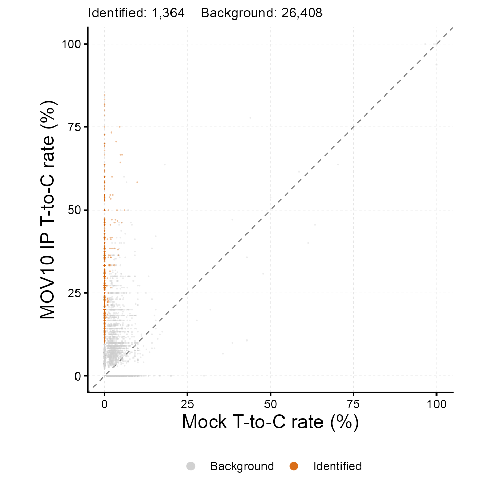
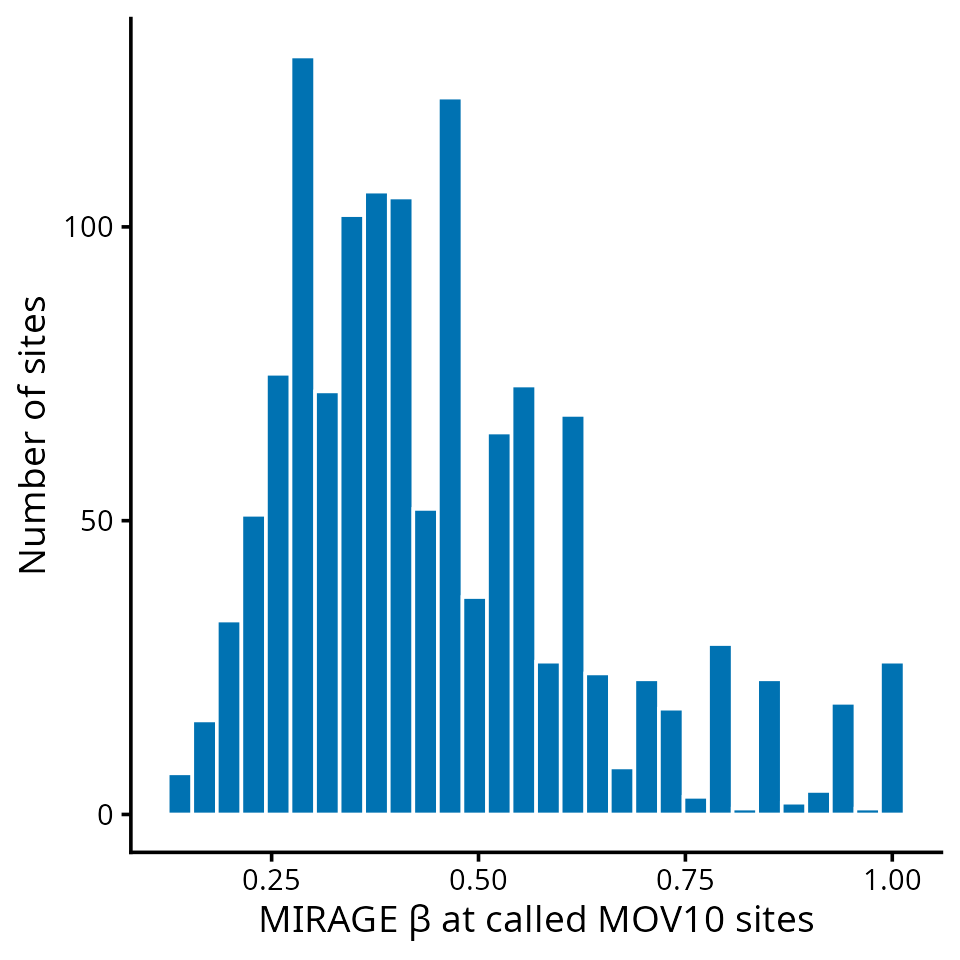

# MIRAGE PAR-CLIP Tutorial

This tutorial shows how MIRAGE identifies protein–RNA crosslink sites
from PAR-CLIP data. In PAR-CLIP, 4-thiouridine is incorporated into
nascent RNA and UV crosslinking to the bound protein causes a diagnostic
T-to-C transition at the crosslinked uridine during reverse
transcription. Every uridine covered by immunoprecipitated reads is a
candidate site; the matched control is a mock or input library.

| MIRAGE parameter | meaning in PAR-CLIP |
|----|----|
| `beta_est` (β) | fraction of molecules crosslinked at the site, i.e. a background-corrected binding score |
| `lambda1` (γ₁) | T-to-C conversion rate at a crosslinked uridine |
| `lambda2` (γ₂) | background T-to-C rate at non-crosslinked uridines |
| `kappa_est` (κ) | reference-allele fraction, so that heterozygous T/C variants are not called as crosslinks |

## Conceptual Overview

PAR-CLIP concept and its MIRAGE parameterization.

## The Example Data

The package ships a chromosome 21 and 22 subset of a MOV10 PAR-CLIP
count table (wild-type MOV10 immunoprecipitation versus a mock control;
GEO GSE48245) so that the tutorial runs in seconds. Each row is one
uridine with T (`fixed`) and total counts in both libraries.

`count_table`` ``<-`` `[`read.delim`](https://rdrr.io/r/utils/read.table.html)`(`` `` `[`system.file`](https://rdrr.io/r/base/system.file.html)`(``"extdata"``, ``"parclip_mov10_chr21_chr22_counts.tsv"``, package ``=`` ``"MIRAGE"``)`` ``)`` `` `[`nrow`](https://rdrr.io/r/base/nrow.html)`(``count_table``)`` ``#> [1] 27772`` `[`head`](https://rdrr.io/r/utils/head.html)`(``count_table``, ``5``)`` ``#> pos motif type treated_fixed_count treated_depth`` ``#> 1 chr21_5116494_- UCUCU NNUNN 9 10`` ``#> 2 chr21_5116734_- UUUGC NNUNN 3 11`` ``#> 3 chr21_5116735_- GUUUG NNUNN 11 11`` ``#> 4 chr21_5116736_- GGUUU NNUNN 11 11`` ``#> 5 chr21_5116740_- UUUAG NNUNN 14 15`` ``#> control_fixed_count control_depth`` ``#> 1 11 11`` ``#> 2 35 35`` ``#> 3 35 35`` ``#> 4 34 35`` ``#> 5 38 38`

`pos` is `<chrom>_<coordinate>_<strand>`, `motif` is the 5-mer around
the uridine, and `type` marks the target base class (`NNUNN`). The full,
genome-wide table has the same columns.

## Infer Crosslink Sites With MIRAGE

[`library`](https://rdrr.io/r/base/library.html)`(`[`MIRAGE`](https://github.com/yangli04/MIRAGE)`)`` ``#> Loading required package: doParallel`` ``#> Loading required package: foreach`` ``#> Loading required package: iterators`` ``#> Loading required package: parallel`` ``#> Loading required package: dplyr`` ``#> `` ``#> Attaching package: 'dplyr'`` ``#> The following objects are masked from 'package:stats':`` ``#> `` ``#> filter, lag`` ``#> The following objects are masked from 'package:base':`` ``#> `` ``#> intersect, setdiff, setequal, union`` `` ``parclip_res`` ``<-`` `[`estimate_inference_with_empirical`](https://yangli04.github.io/MIRAGE/reference/estimate_inference_with_empirical.md)`(`` `` chr.info ``=`` ``count_table``[``, `[`c`](https://rdrr.io/r/base/c.html)`(``"pos"``, ``"motif"``, ``"type"``)``]``,`` `` treatment_fixed_count ``=`` ``count_table``$``treated_fixed_count``,`` `` control_fixed_count ``=`` ``count_table``$``control_fixed_count``,`` `` treatment_depth ``=`` ``count_table``$``treated_depth``,`` `` control_depth ``=`` ``count_table``$``control_depth``,`` `` delta ``=`` ``0.001``,`` `` depth.cutoff ``=`` ``10``,`` `` homo.cutoff ``=`` ``0.99``,`` `` lambda1 ``=`` ``"auto"``,`` `` bg.method ``=`` ``"lrt"``,`` `` bg.target ``=`` ``"both"``,`` `` highly.methyl.cutoff ``=`` ``0.95``,`` `` seed ``=`` ``123``,`` `` thread ``=`` ``tutorial_threads`` ``)`` ``#> Considering 25375 (91.37%) sites as homozygous...`` ``#> Hyper-thread registered: TRUE `` ``#> Using 2 threads to make homo initial test...`` ``#> Considering 19101 (75.27%) sites as background (homozygous sites only)...`` ``#> Hyper-thread registered: TRUE `` ``#> Using 2 threads to make homo final test...`` ``#> Considering 1320 (5.2%) sites as high-signal site candidates (homozygous sites only)...`` ``#> Hyper-thread registered: TRUE `` ``#> Using 2 threads to make homo beta estimation...`` ``#> Hyper-thread registered: TRUE `` ``#> Using 2 threads to make heter beta estimation...`` `` `[`data.frame`](https://rdrr.io/r/base/data.frame.html)`(`` `` n_homosites ``=`` `[`nrow`](https://rdrr.io/r/base/nrow.html)`(``parclip_res``$``homosites``)``,`` `` n_hetersites ``=`` `[`nrow`](https://rdrr.io/r/base/nrow.html)`(``parclip_res``$``hetersites``)``,`` `` lambda1 ``=`` ``parclip_res``$``lambda1``,`` `` lambda2 ``=`` ``parclip_res``$``lambda2`` ``)`` ``#> n_homosites n_hetersites lambda1 lambda2`` ``#> 1 25375 2397 0.627911 0.01357644`

`bg.target = "both"` uses the treatment and control counts together to
estimate the background T-to-C rate, which suits PAR-CLIP where the mock
library is itself sparse at many positions.

## Inspect And Call Sites

A crosslink site call combines the likelihood-ratio FDR with a minimum
β. Sites in `hetersites` carry a `kappa_est` estimate; a genuine T/C
variant appears there with high control conversion and low β.

`homo`` ``<-`` ``parclip_res``$``homosites`` ``called`` ``<-`` ``homo``[``homo``$``lrt_fdr`` ``<`` ``0.05`` ``&`` ``homo``$``beta_est`` ``>=`` ``0.1``, ``]`` `[`nrow`](https://rdrr.io/r/base/nrow.html)`(``called``)`` ``#> [1] 1320`` `` `[`head`](https://rdrr.io/r/utils/head.html)`(`` `` ``called``[`[`order`](https://rdrr.io/r/base/order.html)`(``called``$``lrt_fdr``)``,`` `` `[`c`](https://rdrr.io/r/base/c.html)`(``"pos"``, ``"motif"``, ``"treatment_fixed_rate"``, ``"control_fixed_rate"``, ``"beta_est"``, ``"lrt_fdr"``)``]``,`` `` ``8`` ``)`` ``#> pos motif treatment_fixed_rate control_fixed_rate beta_est`` ``#> 699 chr21_25881309_- AGUCC 0.2727273 1 1.0000000`` ``#> 8900 chr22_20952754_+ CGUAC 0.1538462 1 1.0000000`` ``#> 23533 chr22_39521939_+ AAUAA 0.4705882 1 0.8391858`` ``#> 7342 chr22_18089498_+ UGUGC 0.3214286 1 1.0000000`` ``#> 12800 chr22_28795044_- UGUUC 0.6060606 1 0.6183725`` ``#> 17519 chr22_35295100_+ UCUGC 0.2500000 1 1.0000000`` ``#> 18413 chr22_35741544_- CUUGC 0.4193548 1 0.9226937`` ``#> 20583 chr22_38291218_- CAUCC 0.3636364 1 1.0000000`` ``#> lrt_fdr`` ``#> 699 1.696124e-12`` ``#> 8900 1.696124e-12`` ``#> 23533 7.206994e-08`` ``#> 7342 1.526720e-06`` ``#> 12800 1.526720e-06`` ``#> 17519 2.308107e-06`` ``#> 18413 3.595691e-06`` ``#> 20583 3.993032e-06`` `` `[`head`](https://rdrr.io/r/utils/head.html)`(`` `` ``parclip_res``$``hetersites``[`` `` `[`order`](https://rdrr.io/r/base/order.html)`(``parclip_res``$``hetersites``$``control_fixed_rate``)``,`` `` `[`c`](https://rdrr.io/r/base/c.html)`(``"pos"``, ``"treatment_fixed_rate"``, ``"control_fixed_rate"``, ``"beta_est"``, ``"kappa_est"``, ``"lrt_fdr"``)`` `` ``]``,`` `` ``4`` ``)`` ``#> pos treatment_fixed_rate control_fixed_rate beta_est`` ``#> 4014 chr21_41987559_- 0.0000 0 1`` ``#> 4207 chr21_41988460_- 0.0000 0 1`` ``#> 13484 chr22_30332367_- 0.0000 0 1`` ``#> 20472 chr22_37947136_+ 0.0625 0 0`` ``#> kappa_est lrt_fdr`` ``#> 4014 0.00000 1.0000000`` ``#> 4207 0.00000 1.0000000`` ``#> 13484 0.00000 1.0000000`` ``#> 20472 0.03705 0.6818792`

Save the results:

`out_dir`` ``<-`` `[`file.path`](https://rdrr.io/r/base/file.path.html)`(`[`tempdir`](https://rdrr.io/r/base/tempfile.html)`(``)``, ``"mirage_parclip_output"``)`` `[`dir.create`](https://rdrr.io/r/base/files2.html)`(``out_dir``, showWarnings ``=`` ``FALSE``)`` `[`saveRDS`](https://rdrr.io/r/base/readRDS.html)`(``parclip_res``, `[`file.path`](https://rdrr.io/r/base/file.path.html)`(``out_dir``, ``"mirage_result.rds"``)``)`` `[`write.table`](https://rdrr.io/r/utils/write.table.html)`(``called``, `[`file.path`](https://rdrr.io/r/base/file.path.html)`(``out_dir``, ``"mov10_crosslink_sites.tsv"``)``,`` `` sep ``=`` ``"\t"``, quote ``=`` ``FALSE``, row.names ``=`` ``FALSE``)`` `[`list.files`](https://rdrr.io/r/base/list.files.html)`(``out_dir``)`` ``#> [1] "mirage_result.rds" "mov10_crosslink_sites.tsv"`

## Diagnostic Scatter

[`plot_signal_scatter`](https://yangli04.github.io/MIRAGE/reference/plot_signal_scatter.md)`(`` `` ``parclip_res``,`` `` color_by ``=`` ``"significance"``, fdr_col ``=`` ``"lrt_fdr"``, fdr_cutoff ``=`` ``0.05``,`` `` xlab ``=`` ``"Mock T-to-C rate (%)"``, ylab ``=`` ``"MOV10 IP T-to-C rate (%)"`` ``)`

## Distribution Of Binding Scores

The distribution of β at called sites summarizes crosslinking strength;
a BED-like export makes the sites available to genome browsers and
annotation tools.

[`library`](https://rdrr.io/r/base/library.html)`(`[`ggplot2`](https://ggplot2.tidyverse.org)`)`` `[`ggplot`](https://ggplot2.tidyverse.org/reference/ggplot.html)`(``called``, `[`aes`](https://ggplot2.tidyverse.org/reference/aes.html)`(``x ``=`` ``beta_est``)``)`` ``+`` `` `[`geom_histogram`](https://ggplot2.tidyverse.org/reference/geom_histogram.html)`(``bins ``=`` ``30``, fill ``=`` ``"#0072B2"``, colour ``=`` ``"white"``)`` ``+`` `` `[`labs`](https://ggplot2.tidyverse.org/reference/labs.html)`(``x ``=`` ``"MIRAGE β at called MOV10 sites"``, y ``=`` ``"Number of sites"``)`` ``+`` `` `[`theme_classic`](https://ggplot2.tidyverse.org/reference/ggtheme.html)`(``base_size ``=`` ``14``)`

`parts`` ``<-`` `[`do.call`](https://rdrr.io/r/base/do.call.html)`(``rbind``, `[`strsplit`](https://rdrr.io/r/base/strsplit.html)`(``called``$``pos``, ``"_"``)``)`` ``bed`` ``<-`` `[`data.frame`](https://rdrr.io/r/base/data.frame.html)`(`` `` chrom ``=`` ``parts``[``, ``1``]``,`` `` start ``=`` `[`as.integer`](https://rdrr.io/r/base/integer.html)`(``parts``[``, ``2``]``)`` ``-`` ``1L``,`` `` end ``=`` `[`as.integer`](https://rdrr.io/r/base/integer.html)`(``parts``[``, ``2``]``)``,`` `` name ``=`` ``called``$``pos``,`` `` score ``=`` `[`round`](https://rdrr.io/r/base/Round.html)`(``called``$``beta_est``, ``4``)``,`` `` strand ``=`` ``parts``[``, ``3``]`` ``)`` `[`head`](https://rdrr.io/r/utils/head.html)`(``bed``, ``4``)`` ``#> chrom start end name score strand`` ``#> 1 chr21 5116733 5116734 chr21_5116734_- 1.0000 -`` ``#> 2 chr21 14371317 14371318 chr21_14371318_- 0.8653 -`` ``#> 3 chr21 14371625 14371626 chr21_14371626_- 0.7524 -`` ``#> 4 chr21 14371737 14371738 chr21_14371738_- 0.6283 -`` `[`write.table`](https://rdrr.io/r/utils/write.table.html)`(``bed``, `[`file.path`](https://rdrr.io/r/base/file.path.html)`(``out_dir``, ``"mov10_crosslink_sites.bed"``)``,`` `` sep ``=`` ``"\t"``, quote ``=`` ``FALSE``, row.names ``=`` ``FALSE``, col.names ``=`` ``FALSE``)`

## Adapting To Your Own PAR-CLIP Data

1.  Align IP and control reads, then pile up T and C counts at every
    covered uridine (on the transcribed strand). Any pileup tool that
    reports per-base counts is sufficient.
2.  Build the seven-column table; `motif` and `type` can be
    placeholders.
3.  Run on the genome-wide table (tens of minutes for ~1 million
    uridines with several threads); β and the FDR columns are then used
    to call and rank sites.

## Session Information

[`sessionInfo`](https://rdrr.io/r/utils/sessionInfo.html)`(``)`` ``#> R version 4.5.3 (2026-03-11)`` ``#> Platform: x86_64-conda-linux-gnu`` ``#> Running under: Ubuntu 24.04.4 LTS`` ``#> `` ``#> Matrix products: default`` ``#> BLAS/LAPACK: /home/yangli/software/micromamba/envs/mirage-r/lib/libopenblasp-r0.3.34.so; LAPACK version 3.12.0`` ``#> `` ``#> locale:`` ``#> [1] LC_CTYPE=C.UTF-8 LC_NUMERIC=C LC_TIME=C.UTF-8 `` ``#> [4] LC_COLLATE=C.UTF-8 LC_MONETARY=C.UTF-8 LC_MESSAGES=C.UTF-8 `` ``#> [7] LC_PAPER=C.UTF-8 LC_NAME=C LC_ADDRESS=C `` ``#> [10] LC_TELEPHONE=C LC_MEASUREMENT=C.UTF-8 LC_IDENTIFICATION=C `` ``#> `` ``#> time zone: America/Chicago`` ``#> tzcode source: system (glibc)`` ``#> `` ``#> attached base packages:`` ``#> [1] parallel stats graphics grDevices utils datasets methods `` ``#> [8] base `` ``#> `` ``#> other attached packages:`` ``#> [1] ggplot2_4.0.3 MIRAGE_0.6.0 dplyr_1.2.1 doParallel_1.0.17`` ``#> [5] iterators_1.0.14 foreach_1.5.2 `` ``#> `` ``#> loaded via a namespace (and not attached):`` ``#> [1] gtable_0.3.6 jsonlite_2.0.0 compiler_4.5.3 tidyselect_1.2.1 `` ``#> [5] jquerylib_0.1.4 scales_1.4.0 systemfonts_1.3.2 textshaping_1.0.5 `` ``#> [9] yaml_2.3.12 fastmap_1.2.0 R6_2.6.1 labeling_0.4.3 `` ``#> [13] generics_0.1.4 knitr_1.51 htmlwidgets_1.6.4 tibble_3.3.1 `` ``#> [17] desc_1.4.3 RColorBrewer_1.1-3 bslib_0.12.0 pillar_1.11.1 `` ``#> [21] rlang_1.3.0 cachem_1.1.0 xfun_0.60 S7_0.2.2 `` ``#> [25] fs_2.1.0 sass_0.4.10 otel_0.2.0 cli_3.6.6 `` ``#> [29] withr_3.0.3 pkgdown_2.2.1 magrittr_2.0.5 digest_0.6.39 `` ``#> [33] grid_4.5.3 lifecycle_1.0.5 vctrs_0.7.3 evaluate_1.0.5 `` ``#> [37] glue_1.8.1 farver_2.1.2 codetools_0.2-20 ragg_1.5.2 `` ``#> [41] rmarkdown_2.31 tools_4.5.3 pkgconfig_2.0.3 htmltools_0.5.9`
