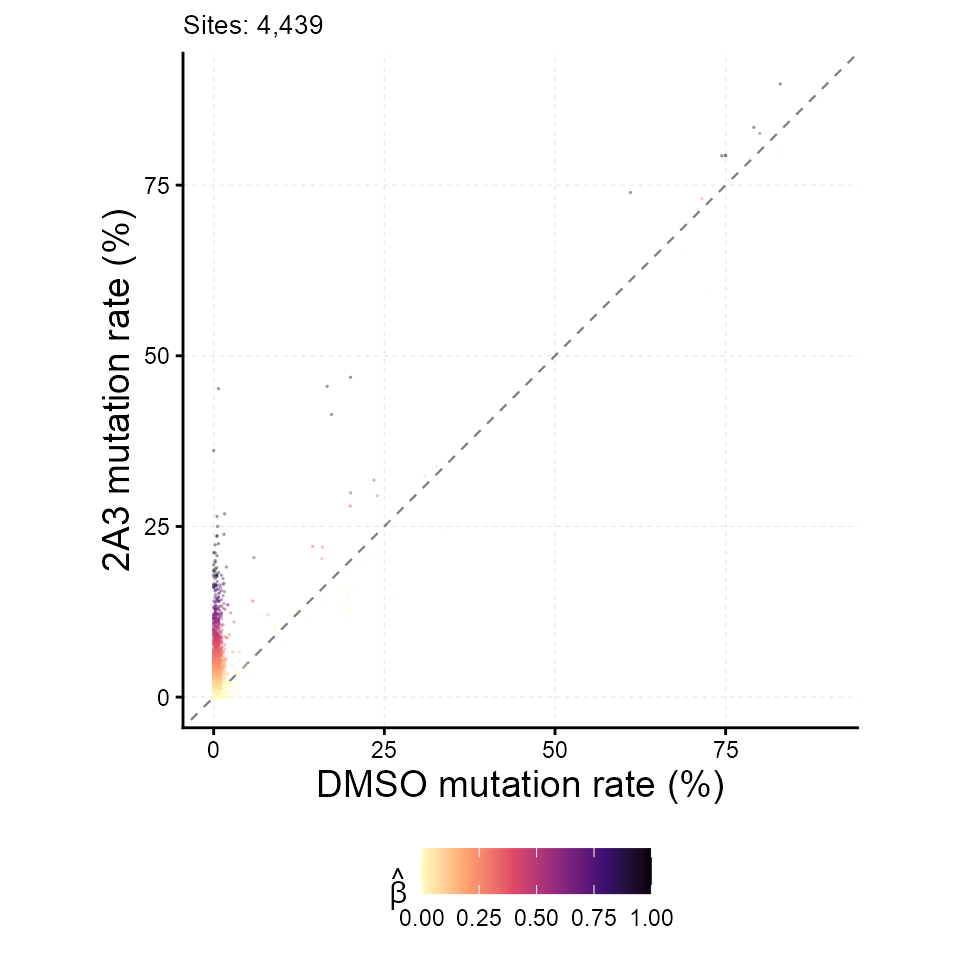
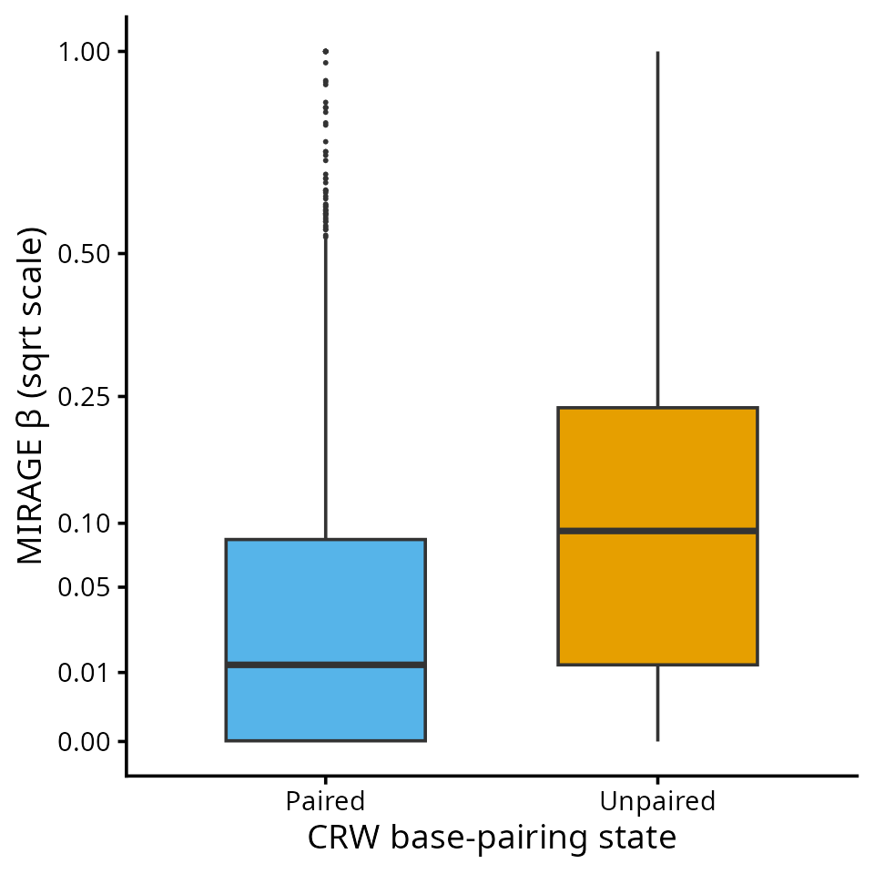

# MIRAGE RNA Structure Tutorial (SHAPE-MaP)

This tutorial shows how MIRAGE is used for RNA structure mutational
profiling (SHAPE-MaP and related chemistries). A structure-probing
reagent acylates flexible, usually unpaired, nucleotides; reverse
transcription then records the adduct as a mutation. Comparing the
reagent-treated sample with a DMSO control, MIRAGE estimates a
per-nucleotide reactivity that is already corrected for background
mutation, sequencing error, and allele mixing.

| MIRAGE parameter | meaning in SHAPE-MaP |
|----|----|
| `beta_est` (β) | fraction of molecules with a reagent-induced adduct at the site, i.e. reactivity on the molecule scale |
| `lambda1` (γ₁) | reagent-induced mutation rate at a fully accessible site |
| `lambda2` (γ₂) | background mutation rate in the treated sample at unreactive sites |

## Conceptual Overview

SHAPE-MaP structure-probing concept and its MIRAGE parameterization.

## The Example Data

The package ships a complete count table for *E. coli* 16S and 23S rRNA
probed in vitro with 2A3 (BioProject PRJNA646706), with three in vitro
DMSO libraries pooled as the control. Per-position pileups were oriented
to the reference strand, mutations were counted as any non-reference
base or deletion, and positions with at least 50 reads in both samples
were kept.

`count_table`` ``<-`` `[`read.delim`](https://rdrr.io/r/utils/read.table.html)`(`` `` `[`system.file`](https://rdrr.io/r/base/system.file.html)`(``"extdata"``, ``"shapemap_ecoli_rRNA_2A3_invitro_counts.tsv"``, package ``=`` ``"MIRAGE"``)`` ``)`` `` `[`nrow`](https://rdrr.io/r/base/nrow.html)`(``count_table``)`` ``#> [1] 4439`` `[`head`](https://rdrr.io/r/utils/head.html)`(``count_table``, ``5``)`` ``#> pos motif type treated_fixed_count treated_depth`` ``#> 1 16S_rRNA_7_+ UGAAG A 50 51`` ``#> 2 16S_rRNA_8_+ GAAGA A 55 56`` ``#> 3 16S_rRNA_9_+ AAGAG G 65 66`` ``#> 4 16S_rRNA_10_+ AGAGU A 71 71`` ``#> 5 16S_rRNA_11_+ GAGUU G 79 81`` ``#> control_fixed_count control_depth`` ``#> 1 227 227`` ``#> 2 232 233`` ``#> 3 241 242`` ``#> 4 248 248`` ``#> 5 261 263`` `[`table`](https://rdrr.io/r/base/table.html)`(``count_table``$``type``)`` ``#> `` ``#> A C G U `` ``#> 1149 987 1395 908`

Here `pos` is `<rRNA>_<position>_+`, `motif` is the 5-mer around the
nucleotide, and `type` is the reference base. The empirical model does
not use `motif` or `type` for inference; they are carried through to the
output for convenience.

The accepted secondary structure of both rRNAs (Comparative RNA Web,
CRW) is shipped as a per-nucleotide pairing table for evaluation.

`pairing`` ``<-`` `[`read.delim`](https://rdrr.io/r/utils/read.table.html)`(`` `` `[`system.file`](https://rdrr.io/r/base/system.file.html)`(``"extdata"``, ``"shapemap_ecoli_rRNA_CRW_pairing.tsv"``, package ``=`` ``"MIRAGE"``)`` ``)`` `[`head`](https://rdrr.io/r/utils/head.html)`(``pairing``, ``3``)`` ``#> pos chrom position base paired`` ``#> 1 16S_rRNA_1_+ 16S_rRNA 1 A 0`` ``#> 2 16S_rRNA_2_+ 16S_rRNA 2 A 0`` ``#> 3 16S_rRNA_3_+ 16S_rRNA 3 A 0`` `[`table`](https://rdrr.io/r/base/table.html)`(``pairing``$``chrom``, ``pairing``$``paired``)`` ``#> `` ``#> 0 1`` ``#> 16S_rRNA 588 954`` ``#> 23S_rRNA 1166 1738`

## Infer Reactivity With MIRAGE

[`library`](https://rdrr.io/r/base/library.html)`(`[`MIRAGE`](https://github.com/yangli04/MIRAGE)`)`` ``#> Loading required package: doParallel`` ``#> Loading required package: foreach`` ``#> Loading required package: iterators`` ``#> Loading required package: parallel`` ``#> Loading required package: dplyr`` ``#> `` ``#> Attaching package: 'dplyr'`` ``#> The following objects are masked from 'package:stats':`` ``#> `` ``#> filter, lag`` ``#> The following objects are masked from 'package:base':`` ``#> `` ``#> intersect, setdiff, setequal, union`` `` ``structure_res`` ``<-`` `[`estimate_inference_with_empirical`](https://yangli04.github.io/MIRAGE/reference/estimate_inference_with_empirical.md)`(`` `` chr.info ``=`` ``count_table``[``, `[`c`](https://rdrr.io/r/base/c.html)`(``"pos"``, ``"motif"``, ``"type"``)``]``,`` `` treatment_fixed_count ``=`` ``count_table``$``treated_fixed_count``,`` `` control_fixed_count ``=`` ``count_table``$``control_fixed_count``,`` `` treatment_depth ``=`` ``count_table``$``treated_depth``,`` `` control_depth ``=`` ``count_table``$``control_depth``,`` `` delta ``=`` ``0.001``,`` `` depth.cutoff ``=`` ``50``,`` `` homo.cutoff ``=`` ``0.99``,`` `` lambda1 ``=`` ``"auto"``,`` `` bg.method ``=`` ``"fisher"``,`` `` bg.target ``=`` ``"both"``,`` `` highly.methyl.cutoff ``=`` ``0.95``,`` `` seed ``=`` ``123``,`` `` thread ``=`` ``tutorial_threads`` ``)`` ``#> Considering 4051 (91.26%) sites as homozygous...`` ``#> Hyper-thread registered: TRUE `` ``#> Using 2 threads to make homo initial test...`` ``#> Considering 2733 (67.46%) sites as background (homozygous sites only)...`` ``#> Hyper-thread registered: TRUE `` ``#> Using 2 threads to make homo final test...`` ``#> Considering 934 (23.06%) sites as high-signal site candidates (homozygous sites only)...`` ``#> Hyper-thread registered: TRUE `` ``#> Using 2 threads to make homo beta estimation...`` ``#> Hyper-thread registered: TRUE `` ``#> Using 2 threads to make heter beta estimation...`` `` `[`data.frame`](https://rdrr.io/r/base/data.frame.html)`(`` `` n_homosites ``=`` `[`nrow`](https://rdrr.io/r/base/nrow.html)`(``structure_res``$``homosites``)``,`` `` n_hetersites ``=`` `[`nrow`](https://rdrr.io/r/base/nrow.html)`(``structure_res``$``hetersites``)``,`` `` lambda1 ``=`` ``structure_res``$``lambda1``,`` `` lambda2 ``=`` ``structure_res``$``lambda2`` ``)`` ``#> n_homosites n_hetersites lambda1 lambda2`` ``#> 1 4051 388 0.1914083 0.003785959`

For structure probing there is no genotype in the usual sense, but the
same allele-aware branch is useful: nucleotides whose *control* already
shows a mutation rate above `1 - homo.cutoff` (for example, natural
modifications or reverse-transcription artefacts) are routed to
`hetersites`, where the extra control signal is absorbed by `kappa_est`
instead of inflating β. In practice the reactivity of every nucleotide
is the union of the two tables.

`reactivity`` ``<-`` `[`rbind`](https://rdrr.io/r/base/cbind.html)`(`` `` `[`cbind`](https://rdrr.io/r/base/cbind.html)`(``structure_res``$``homosites``[``, `[`c`](https://rdrr.io/r/base/c.html)`(``"pos"``, ``"type"``, ``"beta_est"``, ``"fisher_fdr"``)``]``, site_class ``=`` ``"homo"``)``,`` `` `[`cbind`](https://rdrr.io/r/base/cbind.html)`(``structure_res``$``hetersites``[``, `[`c`](https://rdrr.io/r/base/c.html)`(``"pos"``, ``"type"``, ``"beta_est"``, ``"fisher_fdr"``)``]``, site_class ``=`` ``"heter"``)`` ``)`` ``reactivity`` ``<-`` ``reactivity``[`[`order`](https://rdrr.io/r/base/order.html)`(``reactivity``$``pos``)``, ``]`` `[`nrow`](https://rdrr.io/r/base/nrow.html)`(``reactivity``)`` ``#> [1] 4439`` `[`head`](https://rdrr.io/r/utils/head.html)`(``reactivity``, ``5``)`` ``#> pos type beta_est fisher_fdr site_class`` ``#> 4 16S_rRNA_10_+ A 1.006474e-06 1.000000000 homo`` ``#> 94 16S_rRNA_100_+ G 1.006474e-06 1.000000000 homo`` ``#> 994 16S_rRNA_1000_+ A 1.315812e-02 0.522244349 homo`` ``#> 995 16S_rRNA_1001_+ C 2.082204e-01 0.007611698 homo`` ``#> 996 16S_rRNA_1002_+ A 9.173400e-01 0.595037389 heter`

## Diagnostic Scatter

[`plot_signal_scatter`](https://yangli04.github.io/MIRAGE/reference/plot_signal_scatter.md)`(`` `` ``structure_res``,`` `` color_by ``=`` ``"beta_est"``,`` `` xlab ``=`` ``"DMSO mutation rate (%)"``, ylab ``=`` ``"2A3 mutation rate (%)"`` ``)`

## Compare β Between Paired And Unpaired Nucleotides

Reactivity should be higher at unpaired nucleotides. Join β with the CRW
annotation and compare the distributions and the ranking performance.

`reactivity`` ``<-`` `[`merge`](https://rdrr.io/r/base/merge.html)`(``reactivity``, ``pairing``[``, `[`c`](https://rdrr.io/r/base/c.html)`(``"pos"``, ``"paired"``)``]``, by ``=`` ``"pos"``)`` ``reactivity``$``state`` ``<-`` `[`factor`](https://rdrr.io/r/base/factor.html)`(`[`ifelse`](https://rdrr.io/r/base/ifelse.html)`(``reactivity``$``paired`` ``==`` ``1``, ``"Paired"``, ``"Unpaired"``)``,`` `` levels ``=`` `[`c`](https://rdrr.io/r/base/c.html)`(``"Paired"``, ``"Unpaired"``)``)`` `` `[`tapply`](https://rdrr.io/r/base/tapply.html)`(``reactivity``$``beta_est``, ``reactivity``$``state``, ``median``)`` ``#> Paired Unpaired `` ``#> 0.01233527 0.09308379`` `` ``auroc`` ``<-`` ``function``(``score``, ``positive``)`` ``{`` `` ``r`` ``<-`` `[`rank`](https://rdrr.io/r/base/rank.html)`(``score``)`` `` ``n1`` ``<-`` `[`sum`](https://rdrr.io/r/base/sum.html)`(``positive``)``; ``n0`` ``<-`` `[`sum`](https://rdrr.io/r/base/sum.html)`(``!``positive``)`` `` ``(`[`sum`](https://rdrr.io/r/base/sum.html)`(``r``[``positive``]``)`` ``-`` ``n1`` ``*`` ``(``n1`` ``+`` ``1``)`` ``/`` ``2``)`` ``/`` ``(``n1`` ``*`` ``n0``)`` ``}`` ``auroc``(``reactivity``$``beta_est``, ``reactivity``$``state`` ``==`` ``"Unpaired"``)`` ``#> [1] 0.6815549`

[`library`](https://rdrr.io/r/base/library.html)`(`[`ggplot2`](https://ggplot2.tidyverse.org)`)`` `[`ggplot`](https://ggplot2.tidyverse.org/reference/ggplot.html)`(``reactivity``, `[`aes`](https://ggplot2.tidyverse.org/reference/aes.html)`(``x ``=`` ``state``, y ``=`` ``beta_est``)``)`` ``+`` `` `[`geom_boxplot`](https://ggplot2.tidyverse.org/reference/geom_boxplot.html)`(``outlier.size ``=`` ``0.4``, width ``=`` ``0.6``, fill ``=`` `[`c`](https://rdrr.io/r/base/c.html)`(``"#56B4E9"``, ``"#E69F00"``)``)`` ``+`` `` `[`scale_y_sqrt`](https://ggplot2.tidyverse.org/reference/scale_continuous.html)`(``breaks ``=`` `[`c`](https://rdrr.io/r/base/c.html)`(``0``, ``0.01``, ``0.05``, ``0.1``, ``0.25``, ``0.5``, ``1``)``)`` ``+`` `` `[`labs`](https://ggplot2.tidyverse.org/reference/labs.html)`(``x ``=`` ``"CRW base-pairing state"``, y ``=`` ``"MIRAGE β (sqrt scale)"``)`` ``+`` `` `[`theme_classic`](https://ggplot2.tidyverse.org/reference/ggtheme.html)`(``base_size ``=`` ``14``)`

Reactivity profiles for downstream folding (for example, as
pseudo-energy restraints) can be exported directly from `reactivity`,
using `beta_est` per nucleotide.

## Adapting To Your Own Structure-Probing Data

1.  Build a per-nucleotide table with the seven required columns from
    the treated and control pileups. Count every non-reference base (and
    deletions, if your protocol produces them) as a mutation.
2.  Keep `depth.cutoff` high enough that the observed rates are stable
    (50–100 reads is typical for MaP data).
3.  Run the same call once per reagent or condition; γ₁ and γ₂ are
    learned separately for each treated sample, so reactivities from
    different reagents are placed on a comparable β scale.

## Session Information

[`sessionInfo`](https://rdrr.io/r/utils/sessionInfo.html)`(``)`` ``#> R version 4.5.3 (2026-03-11)`` ``#> Platform: x86_64-conda-linux-gnu`` ``#> Running under: Ubuntu 24.04.4 LTS`` ``#> `` ``#> Matrix products: default`` ``#> BLAS/LAPACK: /home/yangli/software/micromamba/envs/mirage-r/lib/libopenblasp-r0.3.34.so; LAPACK version 3.12.0`` ``#> `` ``#> locale:`` ``#> [1] LC_CTYPE=C.UTF-8 LC_NUMERIC=C LC_TIME=C.UTF-8 `` ``#> [4] LC_COLLATE=C.UTF-8 LC_MONETARY=C.UTF-8 LC_MESSAGES=C.UTF-8 `` ``#> [7] LC_PAPER=C.UTF-8 LC_NAME=C LC_ADDRESS=C `` ``#> [10] LC_TELEPHONE=C LC_MEASUREMENT=C.UTF-8 LC_IDENTIFICATION=C `` ``#> `` ``#> time zone: America/Chicago`` ``#> tzcode source: system (glibc)`` ``#> `` ``#> attached base packages:`` ``#> [1] parallel stats graphics grDevices utils datasets methods `` ``#> [8] base `` ``#> `` ``#> other attached packages:`` ``#> [1] ggplot2_4.0.3 MIRAGE_0.6.0 dplyr_1.2.1 doParallel_1.0.17`` ``#> [5] iterators_1.0.14 foreach_1.5.2 `` ``#> `` ``#> loaded via a namespace (and not attached):`` ``#> [1] gtable_0.3.6 jsonlite_2.0.0 compiler_4.5.3 tidyselect_1.2.1 `` ``#> [5] jquerylib_0.1.4 scales_1.4.0 systemfonts_1.3.2 textshaping_1.0.5 `` ``#> [9] yaml_2.3.12 fastmap_1.2.0 R6_2.6.1 labeling_0.4.3 `` ``#> [13] generics_0.1.4 knitr_1.51 htmlwidgets_1.6.4 tibble_3.3.1 `` ``#> [17] desc_1.4.3 RColorBrewer_1.1-3 bslib_0.12.0 pillar_1.11.1 `` ``#> [21] rlang_1.3.0 cachem_1.1.0 xfun_0.60 S7_0.2.2 `` ``#> [25] fs_2.1.0 sass_0.4.10 otel_0.2.0 viridisLite_0.4.3 `` ``#> [29] cli_3.6.6 withr_3.0.3 pkgdown_2.2.1 magrittr_2.0.5 `` ``#> [33] digest_0.6.39 grid_4.5.3 lifecycle_1.0.5 vctrs_0.7.3 `` ``#> [37] evaluate_1.0.5 glue_1.8.1 farver_2.1.2 codetools_0.2-20 `` ``#> [41] ragg_1.5.2 rmarkdown_2.31 tools_4.5.3 pkgconfig_2.0.3 `` ``#> [45] htmltools_0.5.9`
