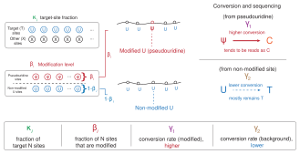

```{r setup, include=FALSE}
knitr::opts_chunk$set(collapse = TRUE, comment = "#>", fig.width = 5, fig.height = 5, out.width = "60%")

tutorial_threads <- min(2L, max(1L, parallel::detectCores(logical = FALSE), na.rm = TRUE))
```

This tutorial shows how MIRAGE quantifies an RNA modification from a
mutation-encoded modification assay. The example is BACS (bisulfite-free
absolute and quantitative sequencing of pseudouridine), in which
pseudouridine (Ψ) is read out as an apparent U-to-C substitution while
unmodified uridines remain largely unchanged. Under MIRAGE the model
parameters take a direct chemical meaning:

| MIRAGE parameter | meaning in BACS |
|---|---|
| `beta_est` (β) | fraction of RNA molecules carrying Ψ at the site, i.e. the Ψ stoichiometry |
| `lambda1` (γ₁) | on-target Ψ-to-C conversion rate of a fully modified site |
| `lambda2` (γ₂) | background U-to-C conversion rate at unmodified uridines |
| `kappa_est` (κ) | reference-allele fraction at heterozygous or allele-mixed sites |

Because β is expressed on the molecule scale after removing background,
sequencing error, and allele mixing, MIRAGE returns an absolute modification
level without a synthetic calibration curve.

## Conceptual Overview

```{r bacs-concept, echo=FALSE, out.width="86%", fig.cap="BACS pseudouridine readout and its MIRAGE parameterization."}

```

## The Example Data

The package ships a small, complete count table built from public HeLa BACS
small-RNA libraries (Gene Expression Omnibus GSE241849). Reads were aligned to
the human cytosolic rRNA references (RefSeq NR_003286.4 18S, NR_003287.4 28S,
NR_003285.3 5.8S), and every uridine position with sufficient depth was kept.
For each uridine, the treated (BACS) T and C counts of two replicates were
pooled, and the untreated control libraries were pooled as the matched control.

```{r load-bacs-counts}
count_table <- read.delim(
  system.file("extdata", "bacs_hela_cyrRNA_counts.tsv", package = "MIRAGE")
)

nrow(count_table)
head(count_table, 5)
```

The seven required columns are `pos`, `motif`, `type`, `treated_fixed_count`,
`treated_depth`, `control_fixed_count`, and `control_depth`. `fixed_count`
is the number of reads that still show the reference base (here, T);
MIRAGE models `1 - fixed_count / depth` as the observed conversion rate. The
site identifier `pos` can be any unique string; here it is
`<RefSeq accession>_<position>`. `motif` and `type` are placeholders because
the empirical (motif-free) model does not use motif priors.

A second table records which of these uridines are known Ψ sites according to
an orthogonal mass-spectrometry (SILNAS) map of the human ribosome, together
with the measured Ψ occupancy. It is used only for evaluation below.

```{r load-bacs-annotation}
silnas <- read.delim(
  system.file("extdata", "bacs_hela_cyrRNA_silnas.tsv", package = "MIRAGE")
)

table(silnas$silnas_psi)
head(silnas[silnas$silnas_psi == 1, ], 4)
```

## Infer Ψ Stoichiometry With MIRAGE

Run the empirical model. `lambda1 = "auto"` estimates the on-target
conversion rate from the highest-signal candidate sites, and
`bg.method = "lrt"` uses the likelihood-ratio test to separate background
uridines from candidate Ψ sites when estimating the background rate.

```{r infer-bacs}
library(MIRAGE)

bacs_res <- estimate_inference_with_empirical(
  chr.info = count_table[, c("pos", "motif", "type")],
  treatment_fixed_count = count_table$treated_fixed_count,
  control_fixed_count = count_table$control_fixed_count,
  treatment_depth = count_table$treated_depth,
  control_depth = count_table$control_depth,
  delta = 0.001,
  depth.cutoff = 20,
  homo.cutoff = 0.99,
  lambda1 = "auto",
  bg.method = "lrt",
  bg.target = "treatment",
  highly.methyl.cutoff = 0.95,
  seed = 123,
  thread = tutorial_threads
)

data.frame(
  n_homosites = nrow(bacs_res$homosites),
  n_hetersites = nrow(bacs_res$hetersites),
  lambda1 = bacs_res$lambda1,
  lambda2 = bacs_res$lambda2
)
```

The estimated on-target conversion rate (γ₁ ≈ 0.83) agrees with the
spike-in-derived conversion efficiency reported for BACS, and the background
rate (γ₂ ≈ 0.14 %) is the chemistry background at unmodified uridines. Both
were learned from the data alone.

## Inspect The Output

`homosites` holds sites whose control sample looks homozygous for the
reference base; `hetersites` holds sites routed to the allele-aware model,
which additionally reports `kappa_est`.

```{r inspect-bacs}
head(
  bacs_res$homosites[
    order(-bacs_res$homosites$beta_est),
    c("pos", "treatment_fixed_rate", "control_fixed_rate", "beta_est", "lrt_fdr")
  ],
  6
)

head(
  bacs_res$hetersites[
    order(-bacs_res$hetersites$beta_est),
    c("pos", "treatment_fixed_rate", "control_fixed_rate", "beta_est", "kappa_est", "lrt_fdr")
  ],
  4
)
```

Save the results as you would in a real analysis:

```{r save-bacs}
out_dir <- file.path(tempdir(), "mirage_bacs_output")
dir.create(out_dir, showWarnings = FALSE)
saveRDS(bacs_res, file.path(out_dir, "mirage_result.rds"))
write.table(bacs_res$homosites, file.path(out_dir, "homosites.tsv"),
            sep = "\t", quote = FALSE, row.names = FALSE)
write.table(bacs_res$hetersites, file.path(out_dir, "hetersites.tsv"),
            sep = "\t", quote = FALSE, row.names = FALSE)
list.files(out_dir)
```

## Diagnostic Scatter

`plot_signal_scatter()` is a one-line diagnostic: each uridine is placed by
its control and treatment conversion rate and shaded by the inferred
stoichiometry `beta_est`. Ψ sites line up on the left edge (no conversion in
the control) with β tracking the BACS conversion rate.

```{r plot-bacs-scatter}
plot_signal_scatter(
  bacs_res,
  color_by = "beta_est",
  xlab = "Control U-to-C rate (%)", ylab = "BACS U-to-C rate (%)"
)
```

## Call Ψ Sites And Compare With Mass Spectrometry

A practical Ψ call combines significance (`lrt_fdr`) with a minimum
stoichiometry (`beta_est`). Compare the calls with the SILNAS annotation.

```{r call-bacs-sites}
sites <- rbind(
  cbind(bacs_res$homosites[, c("pos", "beta_est", "lrt_fdr")], site_class = "homo"),
  cbind(bacs_res$hetersites[, c("pos", "beta_est", "lrt_fdr")], site_class = "heter")
)
sites <- merge(sites, silnas, by = "pos")
sites$called <- sites$lrt_fdr < 0.05 & sites$beta_est >= 0.05

table(SILNAS_psi = sites$silnas_psi, MIRAGE_call = sites$called)
```

For the annotated Ψ sites, MIRAGE β can be compared directly with the
mass-spectrometry occupancy because both are on the molecule scale.

```{r plot-bacs-beta-vs-ms}
psi <- sites[sites$silnas_psi == 1, ]
psi$beta_pct <- 100 * psi$beta_est

cor(psi$beta_pct, psi$silnas_psi_pct)

library(ggplot2)
ggplot(psi, aes(x = silnas_psi_pct, y = beta_pct)) +
  geom_abline(slope = 1, intercept = 0, linetype = "dashed", colour = "gray60") +
  geom_point(size = 1.8, alpha = 0.7, colour = "#0072B2") +
  coord_equal(xlim = c(0, 100), ylim = c(0, 100)) +
  labs(x = "SILNAS mass spectrometry Ψ level (%)",
       y = "MIRAGE β (%)") +
  theme_classic(base_size = 14)
```

## Adapting To Your Own Modification Data

1. Build a per-site table with the seven columns above from your treated and
   control (or in-vitro-transcribed) pileups: `fixed_count` is the count of the
   unconverted reference base, `depth` is the total coverage.
2. Choose `depth.cutoff` according to library depth. Keep `homo.cutoff = 0.99`
   unless your control is known to carry conversion at unmodified sites.
3. Use `lambda1 = "auto"` unless you have a defined on-target conversion rate
   (for example from spike-ins), in which case pass it as a number.
4. Filter results on `beta_est` and one FDR column consistent with
   `bg.method`.

## Session Information

```{r session-info}
sessionInfo()
```
