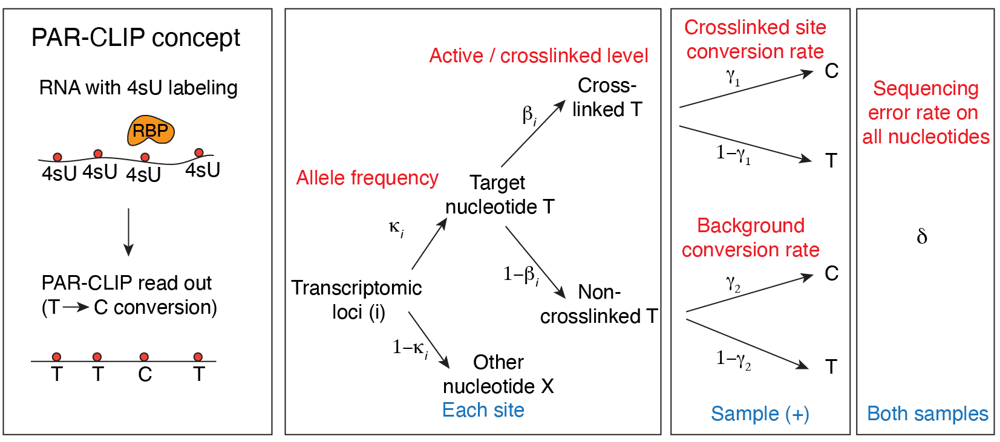

```{r setup, include=FALSE}
knitr::opts_chunk$set(collapse = TRUE, comment = "#>", fig.width = 5, fig.height = 5, out.width = "60%")

tutorial_threads <- min(2L, max(1L, parallel::detectCores(logical = FALSE), na.rm = TRUE))
```

This tutorial shows how MIRAGE identifies protein–RNA crosslink sites from
PAR-CLIP data. In PAR-CLIP, 4-thiouridine is incorporated into nascent RNA
and UV crosslinking to the bound protein causes a diagnostic T-to-C
transition at the crosslinked uridine during reverse transcription. Every
uridine covered by immunoprecipitated reads is a candidate site; the matched
control is a mock or input library.

| MIRAGE parameter | meaning in PAR-CLIP |
|---|---|
| `beta_est` (β) | fraction of molecules crosslinked at the site, i.e. a background-corrected binding score |
| `lambda1` (γ₁) | T-to-C conversion rate at a crosslinked uridine |
| `lambda2` (γ₂) | background T-to-C rate at non-crosslinked uridines |
| `kappa_est` (κ) | reference-allele fraction, so that heterozygous T/C variants are not called as crosslinks |

## Conceptual Overview

```{r parclip-concept, echo=FALSE, out.width="86%", fig.cap="PAR-CLIP concept and its MIRAGE parameterization."}

```

## The Example Data

The package ships a chromosome 21 and 22 subset of a MOV10 PAR-CLIP count
table (wild-type MOV10 immunoprecipitation versus a mock control; GEO GSE48245)
so that the tutorial runs in seconds. Each row is one uridine with T (`fixed`) and total
counts in both libraries.

```{r load-parclip-counts}
count_table <- read.delim(
  system.file("extdata", "parclip_mov10_chr21_chr22_counts.tsv", package = "MIRAGE")
)

nrow(count_table)
head(count_table, 5)
```

`pos` is `<chrom>_<coordinate>_<strand>`, `motif` is the 5-mer around the
uridine, and `type` marks the target base class (`NNUNN`). The full,
genome-wide table has the same columns.

## Infer Crosslink Sites With MIRAGE

```{r infer-parclip}
library(MIRAGE)

parclip_res <- estimate_inference_with_empirical(
  chr.info = count_table[, c("pos", "motif", "type")],
  treatment_fixed_count = count_table$treated_fixed_count,
  control_fixed_count = count_table$control_fixed_count,
  treatment_depth = count_table$treated_depth,
  control_depth = count_table$control_depth,
  delta = 0.001,
  depth.cutoff = 10,
  homo.cutoff = 0.99,
  lambda1 = "auto",
  bg.method = "lrt",
  bg.target = "both",
  highly.methyl.cutoff = 0.95,
  seed = 123,
  thread = tutorial_threads
)

data.frame(
  n_homosites = nrow(parclip_res$homosites),
  n_hetersites = nrow(parclip_res$hetersites),
  lambda1 = parclip_res$lambda1,
  lambda2 = parclip_res$lambda2
)
```

`bg.target = "both"` uses the treatment and control counts together to
estimate the background T-to-C rate, which suits PAR-CLIP where the mock
library is itself sparse at many positions.

## Inspect And Call Sites

A crosslink site call combines the likelihood-ratio FDR with a minimum β.
Sites in `hetersites` carry a `kappa_est` estimate; a genuine T/C variant
appears there with high control conversion and low β.

```{r call-parclip}
homo <- parclip_res$homosites
called <- homo[homo$lrt_fdr < 0.05 & homo$beta_est >= 0.1, ]
nrow(called)

head(
  called[order(called$lrt_fdr),
         c("pos", "motif", "treatment_fixed_rate", "control_fixed_rate", "beta_est", "lrt_fdr")],
  8
)

head(
  parclip_res$hetersites[
    order(parclip_res$hetersites$control_fixed_rate),
    c("pos", "treatment_fixed_rate", "control_fixed_rate", "beta_est", "kappa_est", "lrt_fdr")
  ],
  4
)
```

Save the results:

```{r save-parclip}
out_dir <- file.path(tempdir(), "mirage_parclip_output")
dir.create(out_dir, showWarnings = FALSE)
saveRDS(parclip_res, file.path(out_dir, "mirage_result.rds"))
write.table(called, file.path(out_dir, "mov10_crosslink_sites.tsv"),
            sep = "\t", quote = FALSE, row.names = FALSE)
list.files(out_dir)
```

## Diagnostic Scatter

```{r plot-parclip-scatter}
plot_signal_scatter(
  parclip_res,
  color_by = "significance", fdr_col = "lrt_fdr", fdr_cutoff = 0.05,
  xlab = "Mock T-to-C rate (%)", ylab = "MOV10 IP T-to-C rate (%)"
)
```

## Distribution Of Binding Scores

The distribution of β at called sites summarizes crosslinking strength; a
BED-like export makes the sites available to genome browsers and annotation
tools.

```{r plot-parclip-beta}
library(ggplot2)
ggplot(called, aes(x = beta_est)) +
  geom_histogram(bins = 30, fill = "#0072B2", colour = "white") +
  labs(x = "MIRAGE β at called MOV10 sites", y = "Number of sites") +
  theme_classic(base_size = 14)
```

```{r export-parclip-bed}
parts <- do.call(rbind, strsplit(called$pos, "_"))
bed <- data.frame(
  chrom = parts[, 1],
  start = as.integer(parts[, 2]) - 1L,
  end = as.integer(parts[, 2]),
  name = called$pos,
  score = round(called$beta_est, 4),
  strand = parts[, 3]
)
head(bed, 4)
write.table(bed, file.path(out_dir, "mov10_crosslink_sites.bed"),
            sep = "\t", quote = FALSE, row.names = FALSE, col.names = FALSE)
```

## Adapting To Your Own PAR-CLIP Data

1. Align IP and control reads, then pile up T and C counts at every covered
   uridine (on the transcribed strand). Any pileup tool that reports per-base
   counts is sufficient.
2. Build the seven-column table; `motif` and `type` can be placeholders.
3. Run on the genome-wide table (tens of minutes for ~1 million uridines with
   several threads); β and the FDR columns are then used to call and rank
   sites.

## Session Information

```{r session-info}
sessionInfo()
```
