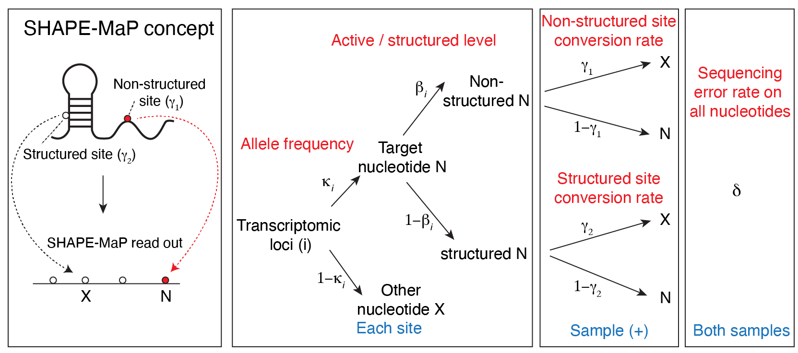

```{r setup, include=FALSE}
knitr::opts_chunk$set(collapse = TRUE, comment = "#>", fig.width = 5, fig.height = 5, out.width = "60%")

tutorial_threads <- min(2L, max(1L, parallel::detectCores(logical = FALSE), na.rm = TRUE))
```

This tutorial shows how MIRAGE is used for RNA structure mutational profiling
(SHAPE-MaP and related chemistries). A structure-probing reagent acylates
flexible, usually unpaired, nucleotides; reverse transcription then records
the adduct as a mutation. Comparing the reagent-treated sample with a
DMSO control, MIRAGE estimates a per-nucleotide reactivity that is already
corrected for background mutation, sequencing error, and allele mixing.

| MIRAGE parameter | meaning in SHAPE-MaP |
|---|---|
| `beta_est` (β) | fraction of molecules with a reagent-induced adduct at the site, i.e. reactivity on the molecule scale |
| `lambda1` (γ₁) | reagent-induced mutation rate at a fully accessible site |
| `lambda2` (γ₂) | background mutation rate in the treated sample at unreactive sites |

## Conceptual Overview

```{r shape-map-concept, echo=FALSE, out.width="86%", fig.cap="SHAPE-MaP structure-probing concept and its MIRAGE parameterization."}

```

## The Example Data

The package ships a complete count table for *E. coli* 16S and 23S rRNA
probed in vitro with 2A3 (BioProject PRJNA646706), with three in vitro DMSO
libraries pooled as the control. Per-position pileups were oriented to the
reference strand, mutations were counted as any non-reference base or
deletion, and positions with at least 50 reads in both samples were kept.

```{r load-structure-counts}
count_table <- read.delim(
  system.file("extdata", "shapemap_ecoli_rRNA_2A3_invitro_counts.tsv", package = "MIRAGE")
)

nrow(count_table)
head(count_table, 5)
table(count_table$type)
```

Here `pos` is `<rRNA>_<position>_+`, `motif` is the 5-mer around the
nucleotide, and `type` is the reference base. The empirical model does not
use `motif` or `type` for inference; they are carried through to the output
for convenience.

The accepted secondary structure of both rRNAs (Comparative RNA Web, CRW) is
shipped as a per-nucleotide pairing table for evaluation.

```{r load-structure-annotation}
pairing <- read.delim(
  system.file("extdata", "shapemap_ecoli_rRNA_CRW_pairing.tsv", package = "MIRAGE")
)
head(pairing, 3)
table(pairing$chrom, pairing$paired)
```

## Infer Reactivity With MIRAGE

```{r infer-structure}
library(MIRAGE)

structure_res <- estimate_inference_with_empirical(
  chr.info = count_table[, c("pos", "motif", "type")],
  treatment_fixed_count = count_table$treated_fixed_count,
  control_fixed_count = count_table$control_fixed_count,
  treatment_depth = count_table$treated_depth,
  control_depth = count_table$control_depth,
  delta = 0.001,
  depth.cutoff = 50,
  homo.cutoff = 0.99,
  lambda1 = "auto",
  bg.method = "fisher",
  bg.target = "both",
  highly.methyl.cutoff = 0.95,
  seed = 123,
  thread = tutorial_threads
)

data.frame(
  n_homosites = nrow(structure_res$homosites),
  n_hetersites = nrow(structure_res$hetersites),
  lambda1 = structure_res$lambda1,
  lambda2 = structure_res$lambda2
)
```

For structure probing there is no genotype in the usual sense, but the same
allele-aware branch is useful: nucleotides whose *control* already shows a
mutation rate above `1 - homo.cutoff` (for example, natural modifications or
reverse-transcription artefacts) are routed to `hetersites`, where the extra
control signal is absorbed by `kappa_est` instead of inflating β. In practice
the reactivity of every nucleotide is the union of the two tables.

```{r combine-structure}
reactivity <- rbind(
  cbind(structure_res$homosites[, c("pos", "type", "beta_est", "fisher_fdr")], site_class = "homo"),
  cbind(structure_res$hetersites[, c("pos", "type", "beta_est", "fisher_fdr")], site_class = "heter")
)
reactivity <- reactivity[order(reactivity$pos), ]
nrow(reactivity)
head(reactivity, 5)
```

## Diagnostic Scatter

```{r plot-structure-scatter}
plot_signal_scatter(
  structure_res,
  color_by = "beta_est",
  xlab = "DMSO mutation rate (%)", ylab = "2A3 mutation rate (%)"
)
```

## Compare β Between Paired And Unpaired Nucleotides

Reactivity should be higher at unpaired nucleotides. Join β with the CRW
annotation and compare the distributions and the ranking performance.

```{r compare-structure}
reactivity <- merge(reactivity, pairing[, c("pos", "paired")], by = "pos")
reactivity$state <- factor(ifelse(reactivity$paired == 1, "Paired", "Unpaired"),
                           levels = c("Paired", "Unpaired"))

tapply(reactivity$beta_est, reactivity$state, median)

auroc <- function(score, positive) {
  r <- rank(score)
  n1 <- sum(positive); n0 <- sum(!positive)
  (sum(r[positive]) - n1 * (n1 + 1) / 2) / (n1 * n0)
}
auroc(reactivity$beta_est, reactivity$state == "Unpaired")
```

```{r plot-structure-beta}
library(ggplot2)
ggplot(reactivity, aes(x = state, y = beta_est)) +
  geom_boxplot(outlier.size = 0.4, width = 0.6, fill = c("#56B4E9", "#E69F00")) +
  scale_y_sqrt(breaks = c(0, 0.01, 0.05, 0.1, 0.25, 0.5, 1)) +
  labs(x = "CRW base-pairing state", y = "MIRAGE β (sqrt scale)") +
  theme_classic(base_size = 14)
```

Reactivity profiles for downstream folding (for example, as pseudo-energy
restraints) can be exported directly from `reactivity`, using `beta_est` per
nucleotide.

## Adapting To Your Own Structure-Probing Data

1. Build a per-nucleotide table with the seven required columns from the
   treated and control pileups. Count every non-reference base (and deletions,
   if your protocol produces them) as a mutation.
2. Keep `depth.cutoff` high enough that the observed rates are stable
   (50–100 reads is typical for MaP data).
3. Run the same call once per reagent or condition; γ₁ and γ₂ are learned
   separately for each treated sample, so reactivities from different reagents
   are placed on a comparable β scale.

## Session Information

```{r session-info}
sessionInfo()
```
